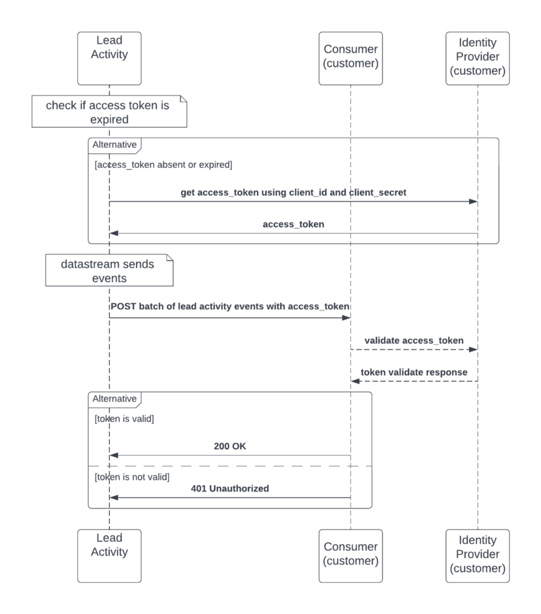

# 데이터 스트림

>[!NOTE]
>
>이제 데이터 스트림에 대한 현재 정보를 [데이터 스트림 사용](https://developer.adobe.com/events/docs/guides/using/marketo/marketo-data-streams#)에서 찾을 수 있습니다.
>

데이터 스트림은 대량의 Marketo Engage 데이터를 거의 실시간으로 외부 시스템에 제공합니다. 스트리밍된 데이터를 사용하여 시기 적절한 결정, 타겟팅된 캠페인, 외부 마케팅 프로세스 및 감사를 지원할 수 있습니다.

데이터 스트림은 다음과 같은 이점을 제공합니다.

- 속도 제한 API 요청에 대한 의존도를 낮춥니다.
- API 제한 경고를 줄입니다.
- 대량 내보내기를 실행하지 않고 데이터를 전달합니다.

데이터 스트림은 [Marketo Engage 성능 계층 패키지](https://nation.marketo.com/t5/product-documents/marketo-engage-performance-tiers/ta-p/328835)를 구입한 사용자가 사용할 수 있습니다.

## 잠재 고객 활동 데이터 스트림 개요

잠재 고객 활동 데이터 스트림 은 대량의 잠재 고객 활동 데이터를 거의 실시간으로 외부 시스템에 전송합니다. 스트림을 사용하여 잠재 고객 이벤트 및 사용 패턴을 감사하고, 잠재 고객 변경 사항을 보고, 잠재 고객 이벤트에서 워크플로우를 트리거합니다.

144개 이상의 활동 유형에 가입할 수 있습니다.

스트림에는 다음이 포함될 수 있습니다.

1. 모든 리드 필드와 새로 생성된 리드에 대한 변경 사항.
1. 모든 문서화된 잠재 고객 활동 유형.
1. 삭제된 잠재 고객.
1. 요청 시 모든 리드 사용자 정의 객체. 개별 사용자 정의 오브젝트는 선택할 수 없습니다.

일반적인 사용 사례는 다음과 같습니다.

- 사용자 지정 경고: 일관되지 않은 상태의 리드를 목록에 추가합니다. 스트림은 목록에 추가 활동을 후속 프로세스로 보냅니다.
- 머신 러닝 모델: 외부 채점 모델에서 활동 인사이트를 사용한 다음, Marketo으로 점수를 전송하여 육성 캠페인 또는 기타 프로세스에 영향을 줍니다.

스트리밍된 활동 목록:

| ObjectiveInReferral | ClickPredictiveContent | ReceivedForwardToFriendEmail |
| --- | --- | --- |
| 목록 추가 | ClickRTPCallToAction | ReceiveSalesEmail |
| AddToGrooth | ClickSalesEmail | ReferToSocialApp |
| AddToOpportunity | ClickSharedLink | RemoveFromList |
| AddToSalesCampaign | 잠재 고객 전환 | RemoveFromOpportunity |
| CallWebhook | DeleteLead | 요청 캠페인 |
| ChangeDataValue | DisqualificationSweepstakes | SalesEmailBounded |
| ChangeLeadPartition | EarnEntryInSocialApp | SendAlert |
| ChangeGroothCadence | 반송된 이메일 | SendEmail |
| ChangeGroothTrack | EmailBoundedSoft | SendSalesEmail |
| 소유자 변경 | EmailDelivered | SentForwardToFriendEmail |
| 프로그램 데이터 변경 | EnrichWithDataDotCom | SFDCAactivity |
| ChangeProgramMemberData | 경품 추첨 | ShareContent |
| 변경 수익 단계 | FillOutFacebookLeadAdsForm | SignUpForReferralOffer |
| ChangeRevenueStageManually | 양식 채우기 | SyncLeadToMicrosoft |
| 점수 변경 | InterestMoment | SyncLeadToSFDC |
| 세그먼트 변경 | 잠재 고객 병합 | 이메일 구독 취소 |
| 진행 상태 변경 | NewLead | UpdateOpportunity |
| ChangeStatusInSalesCampaign | OpenEmail | 웹 페이지 방문 |
| ClickEmail | OpenSalesEmail | 투표 인폴 |
| ClickLink | PushLeadToMarketo | WinSweepstakes |

사용자 지정 개체를 스트리밍할 때 리드 관련 사용자 지정 개체를 모두 포함하십시오. 개별 사용자 정의 오브젝트는 선택할 수 없습니다.

## 사용자 감사 데이터 스트림 개요

사용자 감사 데이터 스트림은 자산에 대한 사용자 변경 사항을 거의 실시간으로 추적합니다. 자산 이벤트를 감사하고, 사용자 변경 사항을 보고, 감사 이벤트에서 프로세스를 트리거하는 데 사용됩니다.

Adobe I/O Events은 구성 가능한 엔드포인트에 변경 사항을 전송합니다. 각 에셋 유형에 필요한 이벤트 유형을 구독합니다.

한 가지 사용 사례는 다음과 같습니다.

- 마케팅 시스템 간 변경 사항 추적: CRM 또는 다른 시스템이 Marketo과 교환할 때 감사 이벤트를 사용하여 최신 변경 사항을 적용한 시스템을 식별합니다.

스트리밍된 사용자 감사 이벤트 목록:

| 구성 요소 | 이벤트 유형 목록 |
| --- | --- |
| 기본 프로그램 | 복제, 생성, 삭제, 채널 편집, 내보내기, 프로그램 설정 수정, 프로그램 토큰 수정, 이름 바꾸기 |
| 이메일 | 승인, 복제, 생성, 삭제, 편집, 이동, 이름 변경, 승인 취소 |
| 이메일 일괄 처리 프로그램 | 승인, 하위 업데이트, 복제, 만들기, 삭제, 편집, 채널 편집, 프로그램 일정 수정, 프로그램 설정 수정, 프로그램 토큰 수정, 이름 바꾸기, 승인 취소 |
| 이메일 템플릿 | 승인, 복제, 생성, 삭제, 초안생성, 초안삭제, 편집, 이름 바꾸기, 승인 취소 |
| 참여 프로그램 | 복제, 생성, 삭제, 채널 편집, 프로그램 설정 수정, 프로그램 스트림 수정, 프로그램 토큰 수정, 이름 바꾸기 |
| 이벤트 프로그램 | 복제, 생성, 삭제, 채널 편집, 프로그램 일정 수정, 프로그램 설정 수정, 프로그램 토큰 수정, 이름 바꾸기 |
| 폴더 | 만들기, 삭제, 편집, 이름 바꾸기 |
| 양식 | 승인, 복제, 생성, 삭제, 초안생성, 편집, 이동, 이름 바꾸기 |
| 양식 -> 랜딩 페이지 양식 | 생성, 복제, 편집, 삭제, 승인, 이름 변경 |
| 랜딩 페이지 | 승인, 복제, 생성, 삭제, 초안Discard, 편집, 이름 바꾸기, 승인 취소 |
| 랜딩 페이지 템플릿 | 승인, 복제, 생성, 삭제, 초안생성, 초안삭제, 편집, 이름 바꾸기, 승인 취소 |
| 스마트 목록 | 복제, 생성, 삭제, 편집, 내보내기, 스마트 목록 설정 수정, 이름 바꾸기 |
| 마케팅 폴더 | 만들기, 편집, 삭제 |
| 육성 프로그램 | 복제, 생성, 삭제, 채널 편집, 프로그램 설정 수정, 프로그램 스트림 수정, 프로그램 토큰 수정, 이름 바꾸기 |
| 세그먼트 | 만들기, 삭제, 편집, 이름 바꾸기 |
| 세분화 | 승인, 만들기, 삭제, 초안 작성, 초안 삭제됨, 이름 바꾸기, 승인 취소 |
| 스마트 캠페인 | 중단, 활성화, 복제, 생성, 비활성화, 삭제, 편집, 캠페인 일정 수정, 흐름 단계 작업 수정, 스마트 목록 설정 수정, 이동, 이름 바꾸기 |
| 스니펫 | 승인, 초안이 없는 승인, 복제, 생성, 삭제, 편집, 이름 변경, 승인 취소 |
| 관리자 UI -> Launchpoint -> 통합 | 만들기, 삭제, 편집 |
| 관리자 UI -> 사용자 | 만들기, 편집, 삭제(API 전용 사용자와 동일) |
| 관리자 로그인 -> 사용자 | 로그인 성공, 로그인 실패 |
| 프로그램 -> 이메일 일괄 처리 프로그램 | 자산 API 편집(선택한 이메일 주소 변경용) |
| 프로그램 -> 마케팅 프로그램 | 생성, 복제 |

사용자 감사 이벤트의 예:

```json
{
    "event_id": "a1b2c3d4-zyxw-9876-9z8y-a1b2c3d4e5f6",
    "event": {
        "specversion": "1.0",
        "id": "b77c743a-8e28-40f2-8aab-9541bbc85e68",
        "type": "com.adobe.platform.marketo.audit.user.email",
        "source": "https://www.marketo.com",
        "time": "2020-05-28T19:20:47.28Z",
        "datacontenttype": "application/json",
        "dataschema": "V1.0",
        "data": {
            "componentId": 232459,
            "componentType": "Email",
            "eventAction": "approve",
            "munchkinId": "123-ABC-456",
            "imsOrgId": "ADOBEORGID@AdobeOrg",
            "user": 253,
            "userId": "example@marketo.com"
        }
    }
}
```

## 알림 데이터 스트림 개요

알림 데이터 스트림은 Marketo Engage의 성능 수준 서비스의 일부로 사용할 수 있습니다.

Marketo 알림 센터는 이메일 주소로 알림을 보낼 수 있습니다. 알림 데이터 스트림도 Adobe I/O Events을 통해 구성 가능한 끝점에 해당 알림을 보냅니다. Marketo UI의 벨 아이콘에서 사용할 수 있는 동일한 알림입니다.

알림 이벤트 목록:

| 구성 요소 | 이벤트 유형 목록 |
| --- | --- |
| 알림 | 캠페인 중단, 캠페인 실패, 육성(프로그램 소진), salesforce 동기화 실패, 테스트 그룹(A/B 테스트 결과), 웹 서비스(일일 할당량) |

알림 이벤트의 예:

```json
{
    "event_id": "a1b2c3d4-zyxw-9876-9z8y-a1b2c3d4e5f6",
    "event": {
        "specversion": "1.0",
        "type": "com.adobe.platform.marketo.notification.campaign_abort",
        "source": "https://www.marketo.com",
        "time": "2021-05-27T10:22:37.489-5:00",
        "datacontenttype": "application/json",
        "dataschema": "V1.0",
        "data": {
            "componentType": "campaign_abort",
            "subType": "user_campaign_abort",
            "eventAction": {
                "campaignId":1234,
                "userId":"example@marketo.com",
            }
            "imsOrgId":"ADOBEORGID@AdobeOrg",
            "munchkinId":"123-ABC-456"
        }
    }
}
```

## 기술 세부 정보

다음 섹션에서는 각 스트림에서 데이터를 받는 데 필요한 구성에 대해 설명합니다. 각 스트림에는 엔드포인트 설정 및 통합 코드가 필요합니다.

### 잠재 고객 활동 데이터 스트림

가망 고객 활동 스트림은 다음 서비스 특성을 사용하여 구독한 가망 고객 활동 이벤트를 보냅니다.

- 데이터는 기본적으로 2초마다 푸시됩니다.
- 각 구독은 100~500개의 레코드 배치를 사용합니다.
- 고객 REST 서비스에는 20초 시간 초과와 3분 간격으로 세 번 다시 시도되는 시간이 있습니다. 재시도가 성공하면 서비스가 자동으로 활성화됩니다. 세 번의 장애가 발생하면 수동으로 프로비저닝을 해제하지 않는 한 서비스가 일시 중지되었다가 3분마다 다시 시도합니다.
- 대기 중인 데이터는 최대 7일 동안 유지됩니다.

가망 고객 활동 데이터 스트림을 구현하려면

1. 공개 인터넷으로부터 JSON 본문이 있는 POST 요청을 수신할 수 있는 HTTP 끝점을 노출합니다. 활동 푸시 데이터 스트림 은 다음 사용자에게 요청을 보냅니다.
1. Adobe에 다음 정보를 제공합니다.
   1. 구독용 Marketo Munchkin ID
   1. 1단계에서 끝점의 URL
   1. 수신하려는 활동 유형(위의 전체 목록)
   1. 고객이 요청이 합법적인지 확인할 수 있는 인증 수단입니다. 다음 중 하나를 수행합니다.
      1. OAuth [클라이언트 자격 증명 인증](https://www.oauth.com/oauth2-servers/access-tokens/client-credentials/)에 대한 ID 공급자 URL, 클라이언트 ID 및 클라이언트 암호
      1. 인증 http 헤더의 잠재 고객 활동 데이터 스트림에서 보낸 요청에 포함될 수 있는 API 토큰

Adobe은 필요한 정보를 수신한 후 데이터 스트림을 활성화합니다. 그러면 끝점이 데이터 수신을 시작합니다.

일반적인 리드 활동 데이터 스트림 호출의 UML 다이어그램:



URL 끝점 생성의 예:

```javascript
/*
Copyright 2022 Adobe
All Rights Reserved.

NOTICE: Adobe permits you to use, modify, and distribute this file in
accordance with the terms of the Adobe license agreement accompanying
it.
*/
constexpress=require('express')
constwinston=require('winston');
constport=3000

constapp=express().use(express.json())

constlogger=winston.createLogger({
  level: 'info',
  format: winston.format.json(),
  defaultMeta: {service: 'activity-stream-consumer-example'},
  transports: [
    // - Write all logs with level `error` and below to `error.log`
    newwinston.transports.File({filename: 'error.log',level: 'error'}),
    // - Write all logs with level `info` and below to `combined.log`
    newwinston.transports.File({filename: 'combined.log'}),
    newwinston.transports.Console({format: winston.format.simple()})
  ],
});

app.get('/',(req,res)=>{
  logger.info(JSON.stringify(req.query))
  res.sendStatus(200)
})

app.post('/',(req,res)=>{
  logger.info(JSON.stringify(req.body))
  res.sendStatus(200)
})

app.listen(port,()=>{
  logger.info(`app listening on port ${port}`)
})
```

샘플 응용 프로그램 코드는 [리드 활동 데이터 스트림 소비자 예제](https://github.com/ihgrant/activity-stream-consumer-example)를 참조하십시오.

### 사용자 감사 데이터 스트림 및 알림 데이터 스트림

사용자 감사 이벤트는 Adobe I/O을 통해 전송됩니다. Adobe ID으로 사용하려면 다음을 수행하십시오.

1. Adobe에 다음 정보를 제공합니다.
   1. Adobe ID
   1. 구독용 Marketo Munchkin ID
1. REST 끝점(일반적으로 웹후크)을 노출하여 이벤트를 사용합니다.
1. 끝점 정보를 받은 후 Adobe은 구독에 대한 스트림을 활성화합니다.
1. Adobe I/O에서 스트림을 구성합니다.
   1. 이 단계에는 Adobe 조직이 필요합니다
   1. Adobe 조직 사용자에게 개발자 또는 시스템 관리자 역할이 있어야 함

Adobe I/O을 구성하려면 [Adobe I/O을 사용하여 Marketo 사용자 감사 데이터 스트림 설정](https://developer.adobe.com/events/docs/guides/using/marketo/marketo-user-audit-data-stream-setup#)을 참조하십시오.

### Marketo에서 사용자 감사 데이터 스트림 설정

사용자 감사 데이터 스트림은 현재 다른 3개의 데이터 스트림과 함께 성능 패키지의 일부로 사용할 수 있습니다. 패키지에 대한 자세한 내용은 제품 제한 및 기능에 대한 [제품 설명 페이지](https://helpx.adobe.com/kr/legal/product-descriptions/adobe-marketo-engage---product-description.html)를 참조하세요.

### Adobe I/O 설정

[Adobe I/O Events 시작하기 를 참조하십시오](https://developer.adobe.com/runtime/docs/guides/getting-started/)

이 사용 사례에 대한 기본 지침은 [console.adobe.io](https://developer.adobe.com/console)부터 시작됩니다.

메시지가 표시되면 **[!UICONTROL Create New Project]** 또는 **[!UICONTROL Add Event]**&#x200B;을(를) 선택합니다.

### 새 프로젝트 시작

Adobe 서비스를 사용하려면 API, 이벤트 또는 런타임을 추가하려면 [설명서](https://developer.adobe.com/runtime/docs/)를 참조하세요.

## 공개 설명서

- [Marketo 데이터 스트림](https://developer.adobe.com/events/docs/guides/using/marketo/marketo-data-streams/)
- [Adobe IO 이벤트 및 웹후크 소개](https://developer.adobe.com/events/docs/guides/)
- [데이터 스트림 블로그](https://blog.developer.adobe.com/introducing-the-adobe-marketo-engage-data-streams-61198b567fbb)
