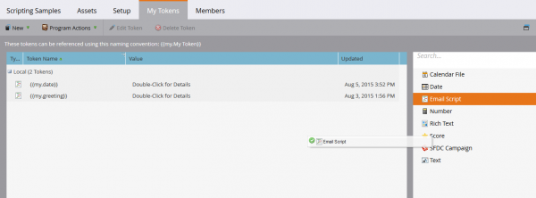

# 이메일 스크립팅

Velocity 템플릿 언어 동작에 대한 자세한 설명은 [Velocity 사용 안내서](https://velocity.apache.org/engine/devel/user-guide.html)를 참조하십시오.

[Apache Velocity](https://velocity.apache.org/)은(는) HTML 콘텐츠를 템플릿화하고 스크립팅하는 Java 기반 언어입니다. Marketo 이메일 스크립팅 토큰의 Velocity를 사용하여 기회 및 사용자 지정 개체에 저장된 데이터에 액세스하고 동적 이메일 콘텐츠를 만듭니다.

Velocity는 조건부 및 반복 콘텐츠에 대한 `if`/`else`, `for` 및 `foreach` 제어 흐름을 제공합니다.

## 변수

변수 접두사로 `$`을(를) 사용합니다. `#set`을(를) 사용하여 만들거나 업데이트하세요.

```velocity
#set($variable = "value")
```

다양한 비헤이비어를 제공하는 참조 유형을 사용하여 변수 값을 검색합니다.

```text
$variable ##outputs 'value'
$variablename ##outputs '$variablename'
${variable}name ##outputs 'valuename'
```


자동 참조 표기법은 `$` 뒤에 `!`을(를) 포함합니다. 참조가 정의되지 않은 경우 기본적으로 속도(Velocity)는 참조 문자열을 그대로 둡니다. 자동 참조는 정의되지 않은 경우 아무 값도 생성하지 않습니다.

```velocity
##Defined Reference

#set($foo = "bar")
$foo ##outputs "bar"

##Undefined Reference

##normal
$baz ##outputs "$baz"

##quiet
$!baz ##outputs nothing
```

변수를 참조하는 방법에 대한 자세한 내용은 [Apache 사용 안내서](https://velocity.apache.org/engine/devel/user-guide.html#formal-reference-notation)를 참조하십시오.

## Velocity 도구

Apache Velocity 프로젝트가 [Velocity 도구](https://velocity.apache.org/tools/devel/apidocs/overview-summary.html)를 제공합니다. 이러한 래퍼는 모든 스크립트에서 사용할 수 있는 전역 변수를 통해 Java 개체 메서드를 노출합니다.

- [Alternator 도구](https://velocity.apache.org/tools/devel/apidocs/org/apache/velocity/tools/generic/AlternatorTool.html)
- [ComparisonDateTool](https://velocity.apache.org/tools/devel/apidocs/org/apache/velocity/tools/generic/ComparisonDateTool.html)
- [변환 도구](https://velocity.apache.org/tools/devel/apidocs/org/apache/velocity/tools/generic/ConversionTool.html)
- [DateTool](https://velocity.apache.org/tools/devel/apidocs/org/apache/velocity/tools/generic/DateTool.html)
- [DisplayTool](https://velocity.apache.org/tools/devel/apidocs/org/apache/velocity/tools/generic/DisplayTool.html)
- [MathTool](https://velocity.apache.org/tools/devel/apidocs/org/apache/velocity/tools/generic/MathTool.html)
- [숫자 도구](https://velocity.apache.org/tools/devel/apidocs/org/apache/velocity/tools/generic/NumberTool.html)
- [EscTool](https://velocity.apache.org/tools/devel/apidocs/org/apache/velocity/tools/generic/EscapeTool.html)
- [LoopTool](https://velocity.apache.org/tools/devel/apidocs/org/apache/velocity/tools/generic/LoopTool.html)

예를 들어 `ComparisonDateTool`의 메서드를 사용하려면 스크립트 토큰의 `$date` 변수에서 액세스하십시오.

```velocity
#set($birthday = $convert.parseDate("2015-08-07","yyyy-MM-dd"))
##use whenIs to determine how many days away it is
$date.whenIs($birthday).days ##outputs 1
```

## 스크립트 토큰 만들기

이메일 스크립트 토큰이 있는 이메일에 Velocity 스크립트를 추가합니다. 마케팅 폴더 또는 프로그램 내의 마케팅 활동에서 토큰을 만듭니다.

토큰을 사용하려면 이메일이 토큰을 소유하는 프로그램의 하위 항목이거나 마케팅 폴더에서 상속해야 합니다. 폴더 또는 프로그램으로 이동하여 [!UICONTROL My Tokens] 탭을 선택합니다. 오른쪽 메뉴의 이메일 스크립트 옵션을 토큰 목록으로 드래그합니다.



토큰 이름을 편집한 다음 [!UICONTROL Click to Edit]을(를) 선택하여 편집기를 엽니다.


편집기에서 스크립트에 액세스할 수 있는 개체의 변수에 액세스하는 스크립트를 만듭니다. 개체 필드 참조를 추가하려면 오른쪽 트리에서 스크립트로 해당 개체를 끕니다.


## 스크립트 포함 및 테스트

프로그램 내 토큰에서 스크립트를 정의한 후 Marketo 이메일 편집기의 이메일에서 해당 스크립트를 참조합니다.


Marketo 이메일 디자이너에서 [!UICONTROL Send Sample Email] 동작을 사용하여 스크립트를 테스트합니다. 스크립트가 올바르게 처리되도록 [!UICONTROL Lead] 필드에서 기존 잠재 고객을 선택하십시오.

`$TriggerObject`을(를) 테스트할 때 [!UICONTROL Trigger] 매개 변수로 트리거 개체를 선택하십시오. Marketo에서는 해당 유형의 가장 최근에 업데이트된 개체를 `$TriggerObject` 변수로 사용합니다.


[!UICONTROL Email Preview]을(를) 사용하여 테스트할 수도 있습니다. **[!UICONTROL View As: Lead Detail]**&#x200B;을(를) 선택한 다음 정적 목록에서 잠재 고객을 선택하십시오. 미리보기에는 스크립트 실행의 예외도 표시됩니다.


## 모범 사례

지정된 이메일에 있는 모든 이메일 스크립트 토큰의 결합된 길이는 100,000바이트를 초과할 수 없습니다. 이 제한은 토큰 문자열 자체의 총 길이와 관련이 있습니다(토큰이 확장된 후의 총 길이는 아님).

- 이메일 스크립트에서 참조한 변수는 스크립트가 사용할 수 있는 개체 중 하나의 Marketo에 있어야 합니다.
- 잠재 고객 또는 연락처에 직접 연결된 기본 통합 CRM에서 비롯된 첫 번째 및 두 번째 수준 사용자 지정 개체를 참조할 수 있지만, 세 번째 수준 사용자 지정 개체는 참조할 수 없습니다. 사용자 지정 개체는 잠재 고객 또는 회사의 상위 개체가 아닐 수 있습니다.
- Marketo 사용자 지정 개체의 경우 상위-하위 관계가 있는 두 번째 수준 사용자 지정 개체를 참조할 수 있습니다. 예 `Lead <- Parent <- Child`. Edge-Bridge 관계에서는 두 번째 수준 사용자 지정 개체를 참조할 수 없습니다. 예: `Lead <- Bridge -> Edge`
- 리드, 연락처 또는 계정에 연결된 사용자 지정 개체를 참조할 수 있지만 두 개 이하여야 합니다.
- 사용자 지정 오브젝트는 단일 연결, 리드, 연락처 또는 계정을 통해서만 참조될 수 있습니다.
- 스크립트 편집기에서 사용 중인 필드의 확인란을 선택합니다. 그렇지 않으면 처리되지 않습니다
- 각 사용자 지정 개체에 대해 사용자/연락처당 가장 최근에 업데이트된 10개의 레코드를 런타임 시 사용할 수 있습니다. 가장 최근에 업데이트된 색인 0에서 가장 오래된 색인 9로 레코드가 정렬됩니다. [지침에 따라](https://experienceleague.adobe.com/ko/docs/marketo/using/product-docs/administration/email-setup/change-custom-object-retrieval-limits-in-velocity-scripting)사용 가능한 레코드 수를 늘릴 수 있습니다.
- 이메일 내에 이메일 스크립트를 두 개 이상 포함하는 경우 스크립트는 위쪽에서 아래쪽으로 실행됩니다. 실행할 첫 번째 스크립트에 정의된 변수의 범위는 후속 스크립트에서 사용할 수 있습니다.
- 도구 참조: [https://velocity.apache.org/tools/2.0/index.html](https://velocity.apache.org/tools/2.0/index.html)
- 줄바꿈 문자 &quot;\n&quot; 또는 &quot;\r\n&quot;을 포함하는 토큰에 대한 참고 사항입니다. 샘플 보내기 또는 배치 캠페인을 통해 이메일을 전송하면 토큰의 새 줄 문자가 공백으로 대체됩니다. 트리거 캠페인을 통해 이메일을 전송하면 줄바꿈 문자가 그대로 유지됩니다.
- 올바른 URL 구문 분석을 위해 전체 경로를 변수로 설정한 다음 인쇄합니다. URL 참조 내부에 변수를 인쇄하지 마십시오. 나머지 URL과 별도로 프로토콜(`http://` 또는 `https://`)을 포함하십시오. 링크를 추적할 수 있도록 전체 앵커(`<a>`) 태그를 출력합니다. `for` 또는 `foreach` 루프의 링크 출력이 추적되지 않습니다.

```html
<!-- Correct -->
#set($url = "www.example.com/${object.id}")
<a href="http://${url}">Link Text</a>

<!-- Correct -->
<a href="http://www.example.com/${object.id}">Link Text</a>

<!-- Incorrect -->
<a href="${url}">Link Text</a>

<!-- Incorrect -->
<a href="{{my.link}}">Link Text</a>

<!-- Incorrect -->
<a href="http://{{my.link}}">Link Text</a>
```
