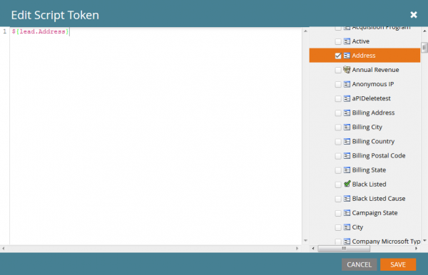
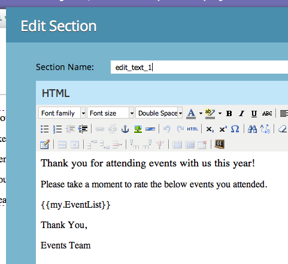

# 이메일 스크립팅

참고: Velocity 템플릿 언어의 동작을 자세히 살펴보려면 [Velocity 사용 안내서](https://velocity.apache.org/engine/devel/user-guide.html)를 읽는 것이 좋습니다.

[Apache Velocity](https://velocity.apache.org/)은(는) HTML 콘텐츠를 템플릿화하고 스크립팅하도록 설계된 Java 기반 언어입니다. Marketo에서는 스크립팅 토큰을 사용하여 이메일 컨텍스트에서 사용할 수 있습니다. 이를 통해 Opportunities 및 Custom Objects에 저장된 데이터에 액세스할 수 있으며 Email에 동적 콘텐츠를 만들 수 있습니다. Velocity는 조건부 및 반복적인 컨텐츠 조작을 허용하기 위해 각 컨텐츠에 대한 if/else, for 및 for 와 함께 표준 고급 제어 흐름을 제공합니다. 다음은 올바른 인사말로 인사말을 인쇄하는 간단한 예입니다.

```java
##check if the lead is male
#if(${lead.MarketoSocialGender} == "Male")
    ##if the lead is male, use the salutation 'Mr.'
    #set($greeting = "Dear Mr. ${lead.LastName},")
##check is the lead is female
#elseif(${lead.MarketoSocialGender} == "Female")
    ##if female, use the salutation 'Ms.'
    #set($greeting = "Dear Ms. ${lead.LastName},")
#else
    ##otherwise, use the first name
    #set($greeting = "Dear ${lead.FirstName},")
#end
##print the greeting and some content
${greeting}

    Lorem ipsum dolor sit amet...
```

## 변수

변수에는 항상 &#39;$&#39; 접두사가 사용되고, 다음을 사용하여 설정 및 #set.

```
#set($variable = "value")
```

그런 다음 비헤이비어가 다른 여러 참조 유형을 통해 값을 검색할 수 있습니다.

```
$variable ##outputs 'value'
$variablename ##outputs '$variablename'
${variable}name ##outputs 'valuename'
```

`!` 뒤에 포함된 `$`이(가) 있는 자동 참조 표기법도 있습니다. 일반적으로 속도가 정의되지 않은 참조를 발견하면 참조를 나타내는 문자열이 제자리에 남게 됩니다. 자동 참조 표기법을 사용할 때 정의되지 않은 참조가 발생하면 값이 전송되지 않습니다.

```
##Defined Reference

#set($foo = "bar")
$foo ##outputs "bar"

##Undefined Reference

##normal
$baz ##outputs "$baz"

##quiet
$!baz ##outputs nothing
```

변수를 참조하는 방법에 대한 자세한 내용은 [Apache 사용 안내서](https://velocity.apache.org/engine/devel/user-guide.html#formal-reference-notation)를 참조하십시오.

## Velocity 도구

Apache Velocity 프로젝트는 [Velocity 도구](https://velocity.apache.org/tools/devel/apidocs/overview-summary.html)를 사용하여 기능을 사용할 수 있도록 합니다. 이는 단순히 Java 개체에 대한 래퍼이며 모든 스크립트에서 사용할 수 있는 전역 변수를 통해 해당 메서드를 노출합니다.

- [AlternatorTool](https://velocity.apache.org/tools/devel/apidocs/org/apache/velocity/tools/generic/AlternatorTool.html)
- [ComparisonDateTool](https://velocity.apache.org/tools/devel/apidocs/org/apache/velocity/tools/generic/ComparisonDateTool.html)
- [전환 도구](https://velocity.apache.org/tools/devel/apidocs/org/apache/velocity/tools/generic/ConversionTool.html)
- [DateTool](https://velocity.apache.org/tools/devel/apidocs/org/apache/velocity/tools/generic/DateTool.html)
- [DisplayTool](https://velocity.apache.org/tools/devel/apidocs/org/apache/velocity/tools/generic/DisplayTool.html)
- [MathTool](https://velocity.apache.org/tools/devel/apidocs/org/apache/velocity/tools/generic/MathTool.html)
- [NumberTool](https://velocity.apache.org/tools/devel/apidocs/org/apache/velocity/tools/generic/NumberTool.html)
- [EscapeTool](https://velocity.apache.org/tools/devel/apidocs/org/apache/velocity/tools/generic/EscapeTool.html)
- [LoopTool](https://velocity.apache.org/tools/devel/apidocs/org/apache/velocity/tools/generic/LoopTool.html)

예를 들어 `ComparisonDateTool`의 메서드를 사용하려면 스크립트 토큰의 `$date` 변수에서 다음과 같은 경우에 액세스하십시오.

```
#set($birthday = $convert.parseDate("2015-08-07","yyyy-MM-dd"))
##use whenIs to determine how many days away it is
$date.whenIs($birthday).days ##outputs 1
```

## 스크립트 토큰 만들기

Velocity 스크립트는 이메일 스크립팅 토큰을 사용하여 이메일에 포함됩니다. 마케팅 폴더 또는 프로그램의 마케팅 활동에서 만들 수 있습니다. 토큰을 이메일 내에서 사용하려면 이메일이 토큰을 소유하거나 마케팅 폴더에서 상속하는 프로그램의 하위 항목이어야 합니다. 토큰을 만들려면 폴더 또는 프로그램으로 이동하여 [!UICONTROL My Tokens] 탭을 선택합니다. 오른쪽 메뉴에서 &#39;이메일 스크립트&#39; 옵션을 토큰 목록으로 드래그합니다


여기에서 토큰 이름을 편집하고 [!UICONTROL Click to Edit] 옵션을 통해 편집기를 열 수 있습니다.


편집기에 있으면 스크립트에 액세스할 수 있는 개체의 모든 변수에 액세스할 수 있는 스크립트를 만들 수 있습니다. 객체에서 필드 참조를 가져오려면 오른쪽 트리에서 스크립트로 해당 객체를 드래그합니다.



## 스크립트 포함 및 테스트

프로그램 내 토큰 내에 스크립트를 정의했으면 Marketo 이메일 편집기를 사용하여 주어진 이메일 내에서 참조할 수 있습니다.



Marketo 이메일 디자이너 내에서 [!UICONTROL Send Sample Email] 이메일 작업을 사용하여 스크립트를 테스트할 수 있습니다. 스크립트를 올바르게 처리하려면 [!UICONTROL Lead] 필드에서 가장할 기존 리드를 선택해야 합니다. `$TriggerObject`을(를) 사용하여 테스트하는 경우 [!UICONTROL Trigger] 매개 변수를 통해 트리거 개체를 선택할 수 있습니다. 해당 유형의 가장 최근에 업데이트된 개체의 데이터를 `$TriggerObject` 변수로 사용합니다.


[!UICONTROL Email Preview]을(를) 사용하여 스크립트를 테스트할 수도 있습니다. 이렇게 하려면 **[!UICONTROL View As: Lead Detail]**&#x200B;을(를) 선택하고 사용 가능한 정적 목록에서 리드를 선택해야 합니다. 이렇게 하면 스크립트 실행 중에 발생했을 수 있는 예외를 추가로 출력할 수 있습니다.


## 유용한 힌트

지정된 이메일에 있는 모든 이메일 스크립트 토큰의 결합된 길이는 100,000바이트를 초과할 수 없습니다. 이 제한은 토큰 문자열 자체의 총 길이와 관련이 있습니다(토큰이 확장된 후의 총 길이는 아님).

- 이메일 스크립트에서 참조한 변수는 스크립트가 사용할 수 있는 개체 중 하나의 Marketo에 있어야 합니다.
- 잠재 고객 또는 연락처에 직접 연결된 기본 통합 CRM에서 비롯된 첫 번째 및 두 번째 수준 사용자 지정 개체를 참조할 수 있지만, 세 번째 수준 사용자 지정 개체는 참조할 수 없습니다. 사용자 지정 개체는 잠재 고객 또는 회사의 상위 개체가 아닐 수 있습니다.
- Marketo 사용자 지정 개체의 경우 상위-하위 관계가 있는 두 번째 수준 사용자 지정 개체를 참조할 수 있습니다. 예: `Lead <- Parent <- Child`. Edge-Bridge 관계에서는 두 번째 수준 사용자 지정 개체를 참조할 수 없습니다. 예: `Lead <- Bridge -> Edge`
- 리드, 연락처 또는 계정에 연결된 사용자 지정 개체를 참조할 수 있지만 두 개 이하여야 합니다.
- 사용자 지정 오브젝트는 단일 연결, 리드, 연락처 또는 계정을 통해서만 참조될 수 있습니다.
- 사용 중인 필드가 처리되지 않는 경우 스크립트 편집기의 상자를 선택해야 합니다
- 각 사용자 정의 객체에 대해 개인/연락처당 가장 최근에 업데이트된 10개의 레코드는 런타임에 사용할 수 있으며 가장 최근에 업데이트된 레코드(0)에서 가장 오래 업데이트된 레코드(9)로 순서가 지정됩니다. [지침에 따라](https://experienceleague.adobe.com/ko/docs/marketo/using/product-docs/administration/email-setup/change-custom-object-retrieval-limits-in-velocity-scripting)사용 가능한 레코드 수를 늘릴 수 있습니다.
- 이메일 내에 이메일 스크립트를 두 개 이상 포함하는 경우 스크립트는 위쪽에서 아래쪽으로 실행됩니다. 실행할 첫 번째 스크립트에 정의된 변수의 범위는 후속 스크립트에서 사용할 수 있습니다.
- 도구 참조: [https://velocity.apache.org/tools/2.0/index.html](https://velocity.apache.org/tools/2.0/index.html)
- 줄바꿈 문자 &quot;\\n&quot; 또는 &quot;\\r\\n&quot;이 포함된 토큰에 대한 참고 사항입니다. 샘플 보내기 또는 배치 캠페인을 통해 이메일을 전송하면 토큰의 새 줄 문자가 공백으로 대체됩니다. 트리거 캠페인을 통해 이메일을 전송하면 줄바꿈 문자가 그대로 유지됩니다.
- URL의 적절한 구문 분석을 위해 전체 경로를 변수로 설정한 다음 인쇄해야 하며, URL 참조 내에 변수를 인쇄해서는 안 됩니다. 프로토콜(http:// 또는 https://)은 포함되어야 하며 URL의 나머지 부분과 분리되어야 합니다. URL도 완전한 형식의 앵커(<a>) 태그의 일부여야 합니다. 링크를 추적하려면 스크립트에서 완전한 형식의 앵커 태그를 출력해야 합니다. for 또는 foreach 루프 내에서 링크가 출력되는 경우 추적되지 않습니다.

```html
<!-- Correct -->
#set($url = "www.example.com/${object.id}")
<a href="http://${url}">Link Text</a>

<!-- Correct -->
<a href="http://www.example.com/${object.id}">Link Text</a>

<!-- Incorrect -->
<a href="${url}">Link Text</a>

<!-- Incorrect -->
<a href="{{my.link}}">Link Text</a>

<!-- Incorrect -->
<a href="http://{{my.link}}">Link Text</a>
```
