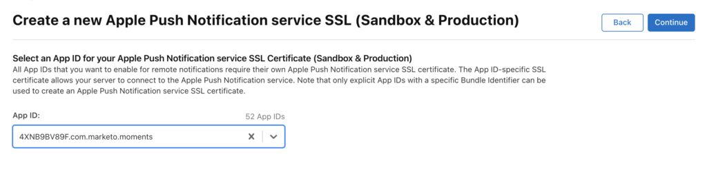
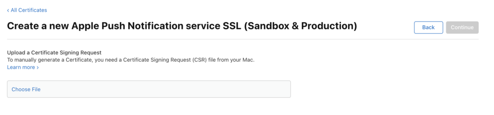
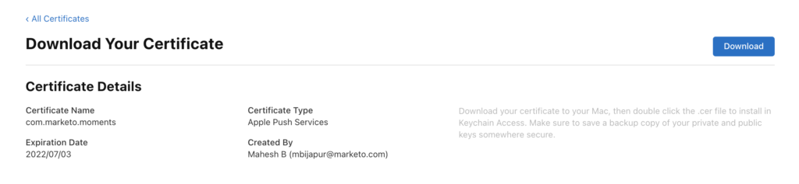
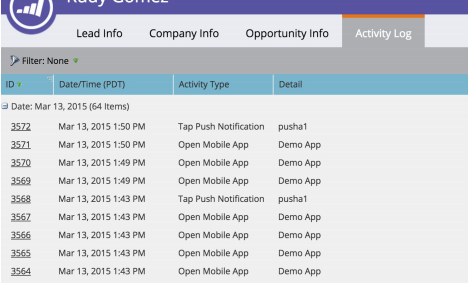

# 푸시 알림

Marketo Mobile SDK을 사용하는 iOS 또는 Android 앱에 대한 푸시 알림을 활성화합니다.

## iOS에서 푸시 알림 설정

푸시 알림을 활성화하는 세 가지 단계가 있습니다.

1. Apple 개발자 계정에서 푸시 알림을 구성합니다.
1. xCode에서 푸시 알림을 활성화합니다.
1. Marketo SDK을 사용하여 앱에서 푸시 알림을 활성화합니다.

### Apple 개발자 계정에서 푸시 알림 구성

1. Apple 개발자 [회원 센터](https://developer.apple.com/membercenter)에 로그인합니다.
1. &quot;인증서, 식별자 및 프로필&quot;을 선택합니다.
1. &quot;iOS, tvOS, watchOS&quot; 아래의 &quot;Certificates->All&quot; 폴더를 선택합니다.
1. 왼쪽 위 모서리에 있는 인증서 옆의 &quot;+&quot;를 선택합니다. 
1. &quot;Apple 푸시 알림 서비스 SSL(샌드박스 및 프로덕션)&quot;을 선택한 다음 계속을 선택합니다.
1. 앱을 빌드하는 데 사용되는 응용 프로그램 식별자를 선택합니다.
1. 푸시 인증서를 생성하려면 CSR을 만들고 업로드하십시오. 
1. 인증서를 다운로드하고 두 번 클릭하여 설치합니다. 
1. &quot;키체인 액세스&quot;를 열고 인증서를 마우스 오른쪽 단추로 클릭한 다음 두 항목을 `.p12` 파일로 내보냅니다.
1. Marketo Admin Console을 통해 이 파일을 업로드하여 알림을 구성합니다.
1. 앱 프로비저닝 프로필을 업데이트합니다.

### xCode에서 푸시 알림 활성화

xCode 프로젝트에서 푸시 알림 기능을 사용하도록 설정합니다.

### Marketo SDK을 사용하여 앱에서 푸시 알림 활성화

`AppDelegate.m` 파일에 다음 코드를 추가하여 고객 장치에 푸시 알림을 전달합니다.

**참고** - [!DNL Adobe Launch] 확장을 사용하는 경우 `ALMarketo`을(를) 클래스 이름으로 사용합니다.

`AppDelegate.h`에 다음 가져오기를 추가하십시오.

>[!BEGINTABS]

>[!TAB 목표 C]

```objectivec
#import <UserNotifications/UserNotifications.h>
```

>[!TAB Swift]

```swift
import UserNotifications
```

>[!ENDTABS]

아래와 같이 `UNUserNotificationCenterDelegate`을(를) `AppDelegate`에 추가합니다.

>[!BEGINTABS]

>[!TAB 목표 C]

```objectivec
@interface AppDelegate : UIResponder <UIApplicationDelegate, UNUserNotificationCenterDelegate>
```

>[!TAB Swift]

```swift
class AppDelegate: UIResponder, UIApplicationDelegate , UNUserNotificationCenterDelegate
```

>[!ENDTABS]

푸시 알림 서비스를 초기화하려면 다음 코드를 추가하십시오.

>[!BEGINTABS]

>[!TAB 목표 C]

```objectivec
BOOL)application:(UIApplication *)application didFinishLaunchingWithOptions:(NSDictionary *)launchOptions {
UNUserNotificationCenter *center = [UNUserNotificationCenter currentNotificationCenter];
        center.delegate = self;
        [center requestAuthorizationWithOptions:(UNAuthorizationOptionSound | UNAuthorizationOptionAlert | UNAuthorizationOptionBadge) completionHandler:^(BOOL granted, NSError * _Nullable error){
            if(!error){
                dispatch_async(dispatch_get_main_queue(), ^{
                    [[UIApplication sharedApplication] registerForRemoteNotifications];
                });
            }
        }];

    return YES;
}
```

>[!TAB Swift]

```swift
func application(_ application: UIApplication, didFinishLaunchingWithOptions launchOptions: [UIApplication.LaunchOptionsKey: Any]?) -> Bool {

    UNUserNotificationCenter.current().requestAuthorization(options: [.alert, .sound,    .badge]) { granted, error in
            if let error = error {
                print("\(error.localizedDescription)")
            } else {
                DispatchQueue.main.async {
                    application.registerForRemoteNotifications()
                }
            }
        }

        return true
}
```

>[!ENDTABS]

이 메서드를 호출하여 Apple 푸시 서비스에 등록을 시작합니다. 등록이 성공하면 앱에서 App 위임 개체의 `application:didRegisterForRemoteNotificationsWithDeviceToken:` 메서드를 호출하여 장치 토큰으로 전달합니다.

등록이 실패하면 앱은 앱 위임자의 `application:didFailToRegisterForRemoteNotificationsWithError:` 메서드를 대신 호출합니다.

Marketo에 푸시 토큰을 등록합니다. Marketo에서 푸시 알림을 받으려면 장치 토큰을 등록해야 합니다.

>[!BEGINTABS]

>[!TAB 목표 C]

```objectivec
- (void)application:(UIApplication *)application didRegisterForRemoteNotificationsWithDeviceToken:(NSData *)deviceToken {
    // Register the push token with Marketo
    [[Marketo sharedInstance] registerPushDeviceToken:deviceToken];
}
```

>[!TAB Swift]

```swift
func application(_ application: UIApplication, didRegisterForRemoteNotificationsWithDeviceToken deviceToken: Data) {
    // Register the push token with Marketo
    Marketo.sharedInstance().registerPushDeviceToken(deviceToken)
}
```

>[!ENDTABS]

사용자가 로그아웃할 때 토큰의 등록을 취소할 수도 있습니다.

>[!BEGINTABS]

>[!TAB 목표 C]

```objectivec
[[Marketo sharedInstance] unregisterPushDeviceToken];
```

>[!TAB Swift]

```swift
Marketo.sharedInstance().unregisterPushDeviceToken
```

>[!ENDTABS]

푸시 토큰을 다시 등록하려면 3단계의 코드를 AppDelegate 메서드에 추출합니다. ViewController 로그인 메서드에서 해당 메서드를 호출합니다.

Marketo에 장치 토큰을 등록한 후 푸시 알림을 처리합니다.

>[!BEGINTABS]

>[!TAB 목표 C]

```objectivec
- (void)application:(UIApplication *)application didReceiveRemoteNotification:(NSDictionary *)userInfo
{
    [[Marketo sharedInstance] handlePushNotification:userInfo];
}
```

>[!TAB Swift]

```swift
func application(_ application: UIApplication, didReceiveRemoteNotification userInfo: [AnyHashable : Any]) {
    Marketo.sharedInstance().handlePushNotification(userInfo)
}
```

>[!ENDTABS]

AppDelegate에 다음 메서드를 추가합니다.

이 메서드를 사용하여 앱이 포그라운드에 있을 때 경고를 표시하거나, 사운드를 재생하거나, 배지를 늘립니다. 이 메서드에서 적절한 completionHandler를 호출합니다.

>[!BEGINTABS]

>[!TAB 목표 C]

```objectivec
-(void)userNotificationCenter:(UNUserNotificationCenter *)center
    willPresentNotification:(UNNotification *)notification
        withCompletionHandler:(void (^)(UNNotificationPresentationOptions options))completionHandler{

    completionHandler(UNAuthorizationOptionSound | UNAuthorizationOptionAlert | UNAuthorizationOptionBadge);
}
```

>[!TAB Swift]

```swift
func userNotificationCenter(_ center: UNUserNotificationCenter,
            willPresent notification: UNNotification, withCompletionHandler completionHandler: @escaping (
    UNNotificationPresentationOptions) -> Void) {
    completionHandler([.alert, .sound,.badge])
}
```

>[!ENDTABS]

AppDelegate에서 새로 받은 푸시 알림을 처리합니다.

사용자가 애플리케이션을 열거나, 알림을 무시하거나, UNNotificationAction을 선택하여 알림에 응답할 때 위임은 이 메서드를 호출합니다. 응용 프로그램이 applicationDidFinishLaunch에서 반환되기 전에 대리자를 설정하십시오.

>[!BEGINTABS]

>[!TAB 목표 C]

```objectivec
- (void)userNotificationCenter:(UNUserNotificationCenter *)center
didReceiveNotificationResponse:(UNNotificationResponse *)response withCompletionHandler:(void(^)(void))completionHandler {
    [[Marketo sharedInstance] userNotificationCenter:center didReceiveNotificationResponse:response withCompletionHandler:completionHandler];
}
```

>[!TAB Swift]

```swift
func userNotificationCenter(_ center: UNUserNotificationCenter,
                                didReceive response: UNNotificationResponse,
                                withCompletionHandler
                                completionHandler: @escaping () -> Void) {
        Marketo.sharedInstance().userNotificationCenter(center, didReceive: response, withCompletionHandler: completionHandler)
}
```

>[!ENDTABS]

푸시 알림을 추적합니다.

앱이 백그라운드에 있거나 비활성 상태인 경우, 디바이스는 아래와 같이 푸시 알림을 수신합니다. Marketo은 사용자가 알림을 선택하면 추적합니다.


장치가 푸시 알림을 받으면 알림을 앱 대리자의 `application:didReceiveRemoteNotification:` 콜백으로 전달합니다.

다음 Marketo 활동 로그는 앱 이벤트 및 푸시 알림 이벤트를 보여 줍니다.



## Android에서 푸시 알림 설정

1. 애플리케이션 태그 내에 다음 권한을 추가합니다.

   `AndroidManifest.xml`을(를) 열고 다음 권한을 추가합니다. 앱에서 &quot;인터넷&quot; 및 &quot;ACCESS_NETWORK_STATE&quot; 권한을 요청해야 합니다. 앱에서 이미 요청한 경우 이 단계를 건너뜁니다.

   ```xml
   <uses‐permission android:name="android.permission.INTERNET"/>
   <uses‐permission android:name="android.permission.ACCESS_NETWORK_STATE"/>
   
   <!‐‐Following permissions are required for push notification.‐‐>
   <uses-permission android:name="android.permission.GET_ACCOUNTS"/>
   <!‐‐Keeps the processor from sleeping when a message is received.‐‐>
   <uses-permission android:name="android.permission.WAKE_LOCK"/>
   <permission android:name="<PACKAGE_NAME>.permission.C2D_MESSAGE" android:protectionLevel="signature" />
   <uses-permission android:name="<PACKAGE_NAME>.permission.C2D_MESSAGE" />
   <!-- This app has permission to register and receive data message. -->
   <uses-permission android:name="com.google.android.c2dm.permission.RECEIVE" />
   ```

1. HTTPv1을 사용하여 FCM을 설정합니다.

   - Marketo 기능 관리자에서 MME FCM HTTPv1을 활성화합니다. 
   - MLM에서 앱에 대한 서비스 계정 JSON 파일을 업로드합니다.
   - Firebase 콘솔에서 서비스 계정 Json 파일을 다운로드합니다. 
   - 푸시 알림을 전송하기 전에 Marketo에서 서비스 계정 JSON 파일을 업로드한 후 1시간 동안 기다립니다.

## Android 테스트 장치

Marketo 활동을 응용 프로그램 태그 내의 매니페스트 파일에 추가합니다.

```xml
<activity android:name="com.marketo.MarketoActivity"  android:configChanges="orientation|screenSize">
    <intent-filter android:label="MarketoActivity">
        <action  android:name="android.intent.action.VIEW"/>
        <category  android:name="android.intent.category.DEFAULT"/>
        <category  android:name="android.intent.category.BROWSABLE"/>
        <data android:host="add_test_device" android:scheme="mkto"/>
    </intent-filter/>
</activity/>
```

## Marketo 푸시 서비스 등록

1. 응용 프로그램 태그를 닫기 전에 `AndroidManifest.xml`에 Firebase 메시징 서비스를 추가하십시오.

   ```xml
   <meta-data
       android:name="com.google.android.gms.version"
       android:value="@integer/google_play_services_version" />
   <service android:name=".MyFirebaseMessagingService">
   <intent-filter>
   <action android:name="com.google.firebase.INSTANCE_ID_EVENT"/>
   <action android:name="com.google.firebase.MESSAGING_EVENT"/>
   </intent-filter>
   </service>
   ```

1. 다음과 같이 Marketo SDK 메서드를 `MyFirebaseMessagingService`에 추가합니다.

   ```java
   import com.marketo.Marketo;
   
   public class MyFirebaseMessagingService extends FirebaseMessagingService {
   
       @Override
       public void onNewToken(String s) {
           super.onNewToken(s);
           Marketo marketoSdk = Marketo.getInstance(this.getApplicationContext());
           marketoSdk.setPushNotificaitonToken(s);
           // Add your code here...
       }
   
       @Override
       public void onMessageReceived(RemoteMessage remoteMessage) {
           Marketo marketoSdk = Marketo.getInstance(this.getApplicationContext());
           marketoSdk.showPushNotificaiton(remoteMessage);
           // Add your code here...
       }
   
   }
   ```

   **참고** - Adobe 확장을 사용하는 경우 다음 코드를 추가합니다.

   ```java
   import com.marketo.Marketo;
   
   public class MyFirebaseMessagingService extends FirebaseMessagingService {
   
       @Override
       public void onNewToken(String token) {
           super.onNewToken(token);
           ALMarketo.setPushNotificationToken(token);
           // Add your code here...
       }
   
       @Override
       public void onMessageReceived(RemoteMessage remoteMessage) {
           ALMarketo.showPushNotification(remoteMessage);
           // Add your code here...
       }
   
   }
   ```

**참고**: FCM SDK은 필요한 권한 및 받는 사람 기능을 자동으로 추가합니다. 이전 SDK 버전을 사용한 경우 메시지가 중복될 수 있는 다음 오래된 요소를 제거합니다.

```xml
<receiver android:name="com.marketo.MarketoBroadcastReceiver" android:permission="com.google.android.c2dm.permission.SEND">
    <intent-filter>
        <!‐‐Receives the actual messages.‐‐>
        <action android:name="com.google.android.c2dm.intent.RECEIVE"/>
        <!‐‐Register to enable push notification‐‐>
        <action android:name="com.google.android.c2dm.intent.REGISTRATION"/>
        <!‐‐‐Replace YOUR_PACKAGE_NAME with your own package name‐‐>
        <category android:name="YOUR_PACKAGE_NAME"/>
    </intent-filter>
</receiver>

<!‐‐Marketo service to handle push registration and notification‐‐>
<service android:name="com.marketo.MarketoIntentService"/>
```

1. Marketo 푸시를 초기화합니다. 구성을 저장한 후 Application 클래스를 만들거나 열고 다음 코드를 추가합니다. Firebase 콘솔에서 발신자 ID를 가져옵니다.

   ```java
   Marketo marketoSdk = Marketo.getInstance(getApplicationContext());
   
   // Enable push notification here. The push notification channel name can by any string
   marketoSdk.initializeMarketoPush(SENDER_ID,"ChannelName");
   ```

   [!DNL Adobe Launch] 확장을 사용하는 경우 다음 코드를 사용하십시오.

   ```java
   // Enable push notification here. The push notification channel name can by any string
   ALMarketo.initializeMarketoPush(SENDER_ID,"ChannelName");
   ```

   SENDER_ID가 없는 경우 [이 자습서](https://developers.google.com/cloud-messaging/)에 설명된 단계를 완료하여 Google Cloud Messaging Service를 사용하도록 설정하십시오.

   사용자가 로그아웃할 때 토큰의 등록을 취소할 수도 있습니다.

   ```java
   marketoSdk.uninitializeMarketoPush();
   ```

   [!DNL Adobe Launch] 확장을 사용하는 경우 다음 코드를 사용하십시오.

   ```java
   ALMarketo.uninitializeMarketoPush();
   ```

   참고: 푸시 토큰을 다시 등록하려면 3단계의 코드를 AppDelegate 메서드에 추출합니다. ViewController 로그인 메서드에서 해당 메서드를 호출합니다.

1. 선택 사항: 알림 아이콘을 설정합니다. 다음 메서드를 호출하여 사용자 지정 알림 아이콘을 구성합니다.

   ```java
   MarketoConfig.Notification config = new MarketoConfig.Notification();
   // Optional bitmap for honeycomb and above
   config.setNotificationLargeIcon(bitmap);
   
   // Required icon Resource ID
   config.setNotificationSmallIcon(R.drawable.notification_small_icon);
   
   // Set the configuration
   //Use the static methods on ALMarketo class when using Adobe Extension
   Marketo.getInstance(context).setNotificationConfig(config);
   
   // Get the configuration set
   Marketo.getInstance(context).getNotificationConfig();
   ```

## 문제 해결

모바일 푸시 메시지가 예상대로 작동하지 않는 경우 구현 세부 사항을 조사하기 전에 일반적인 구성 문제를 확인하십시오.

### 푸시 메시지가 표시되지 않음

푸시 메시지가 장치에서 비활성화되어 있는지 확인합니다. 모바일 사용자는 각 앱에 대한 메시지를 수신하는지 여부를 제어할 수 있으며, 개발자나 마케터는 개발 중에 메시지를 비활성화할 수 있습니다.

앱이 열려 있고 활성화되어 있는지 확인합니다. 앱이 활성 상태일 때 모바일 푸시 메시지가 화면에 표시되지 않습니다. 대신 앱의 &quot;로컬 알림&quot; 영역에 표시됩니다.

### Marketo에서 활동 로그 보기

Marketo 활동 로그를 사용하여 메시지가 전송되었는지 확인합니다.

메시지를 수신해야 하는 사용자에 대한 활동 레코드를 검토합니다. 메시지가 전송된 경우 활동 로그에 레코드가 포함됩니다. 레코드가 없으면 Marketo에서 iOS 인증서 또는 Android API 키 구성을 확인하십시오.

### 인증서 또는 키가 잘못됨

샌드박스 또는 프로덕션에 대해 올바른 인증서가 로드되었는지 확인합니다. 필요한 경우 iOS 인증서 또는 Android 키를 다시 내보내고 Marketo에 다시 로드합니다.

### .p12 파일에 인증서 또는 키가 없습니다(iOS).

인증서를 내보낼 때 키와 인증서를 모두 내보냅니다.

### 프로비전 프로필이 오래됨(iOS)

장치를 추가한 후 프로비저닝 프로필을 업데이트하고 새 인증서를 생성합니다. Xcode 프로젝트를 올바른 프로필과 인증서로 가리킨 다음 인증서를 Marketo으로 가져옵니다.

### iOS 인증서(IOS)를 업로드할 수 없음

인증서를 내보내는 데 사용되는 암호에 공백이 없는지 확인하십시오. 예를 들어, 다음 대신

`Hello World 123`

사용:

`HelloWorld123`

### iOS 인증서 문제 해결

샌드박스 애플리케이션의 경우 &quot;개발자&quot; 또는 &quot;범용&quot; 인증서를 사용합니다. 프로덕션 애플리케이션의 경우 유효한 &quot;배포&quot; 또는 &quot;범용&quot; 인증서를 업로드하십시오.

### 푸시 바운스 / 잘못된 토큰

등록 토큰은 다음 시나리오에서 유효하지 않을 수 있습니다.

- 클라이언트 앱이 GCM 등록을 취소하는 경우.
- 클라이언트 앱이 자동으로 등록 취소된 경우, 이는 사용자가 애플리케이션을 제거할 때 발생할 수 있습니다. 예를 들어 iOS에서 APNS 피드백 서비스가 APNS 토큰을 유효하지 않은 것으로 보고한 경우
- 등록 토큰이 만료되는 경우. 예를 들어 Google이 등록 토큰을 새로 고치도록 결정하거나 iOS 장치에 대한 APNS 토큰이 만료되었을 수 있습니다.
- 클라이언트 앱이 업데이트되었지만 새 버전이 메시지를 받도록 구성되지 않은 경우.
