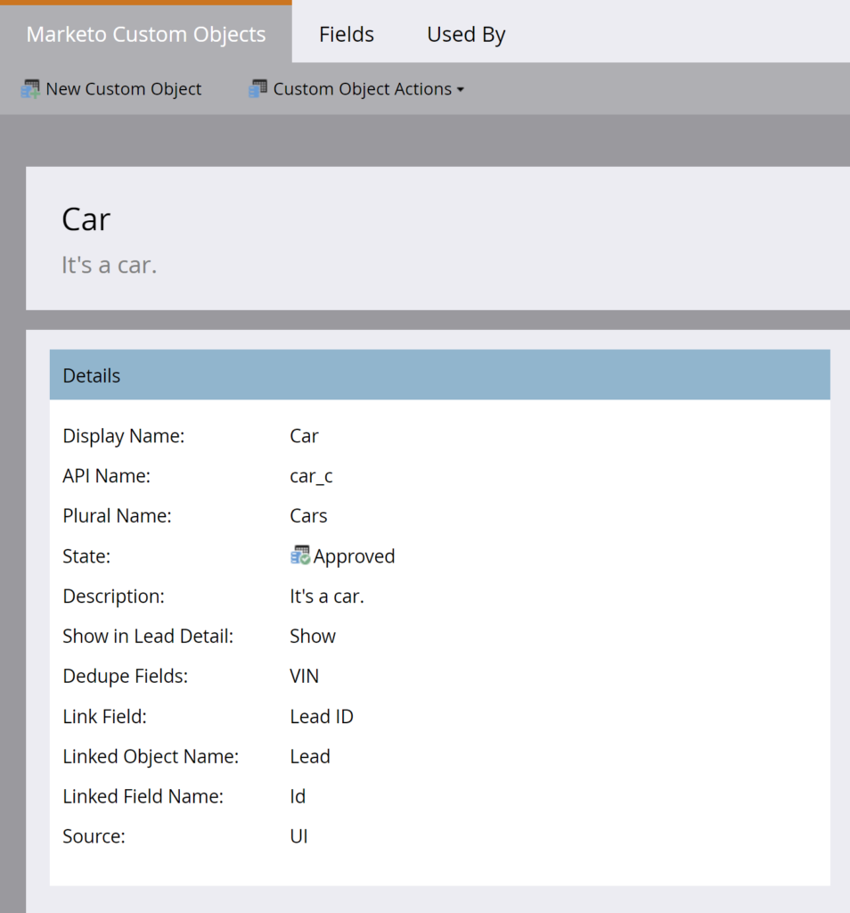
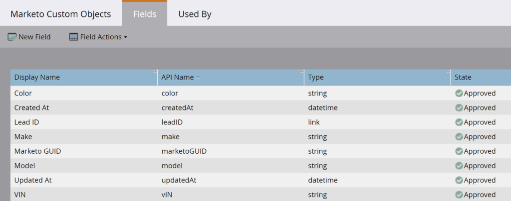

# 대량 사용자 지정 개체 추출

[대량 사용자 지정 개체 추출 끝점 참조](https://developer.adobe.com/marketo-apis/api/mapi#tag/Bulk-Export-Custom-Objects)

대량 사용자 지정 개체 추출 REST API는 Marketo에서 대규모 사용자 지정 개체 레코드 집합을 검색합니다. Marketo과 외부 시스템, ETL, 데이터 웨어하우징 및 아카이빙 간의 지속적인 데이터 교환을 위해 이러한 API를 사용합니다.

API는 리드에 직접 연결된 첫 번째 수준 Marketo 사용자 지정 개체 레코드를 내보냅니다. 사용자 지정 개체 이름 및 연결된 잠재 고객 목록을 지정합니다. 각 리드에 대해 API는 일치하는 연결된 사용자 지정 개체 레코드를 내보내기 파일의 행으로 기록합니다.

Marketo UI의 잠재 고객 세부 정보 페이지에 있는 [사용자 지정 개체 탭](https://experienceleague.adobe.com/en/docs/marketo/using/product-docs/administration/marketo-custom-objects/understanding-marketo-custom-objects)에서 사용자 지정 개체 데이터를 볼 수 있습니다.

## 권한

API 사용자는 읽기 전용 사용자 지정 개체 권한, 읽기-쓰기 사용자 지정 개체 권한 또는 둘 다 있는 역할이 있어야 합니다.

## 필터

사용자 지정 개체 추출 필터는 사용자 지정 개체에 연결된 리드 목록을 지정합니다. 나열된 리드가 지정된 사용자 지정 개체 이름과 일치하는 레코드에 연결되는 경우 API는 해당 레코드를 내보내기 파일에 기록합니다.

내보내기 작업당 하나의 필터 유형만 지정합니다.

| 필터 유형 | 데이터 유형 | 참고 |
| --- | --- | --- |
| `updatedAt` | 날짜 범위 | `startAt` 및 `endAt` &nbsp;`startAt` 멤버가 있는 JSON 개체를 수락합니다.에서는 로우 워터마크를 나타내는 날짜/시간을 수락하고 `endAt`에서는 하이 워터마크를 나타내는 날짜/시간을 수락합니다. 범위는 31일 이하여야 합니다. 이 필터 유형의 작업은 날짜 범위 내에서 업데이트된 액세스 가능한 모든 레코드를 반환합니다. 날짜/시간은 밀리초 없이 ISO-8601 형식이어야 합니다. |
| `staticListName` | 문자열 | 정적 목록의 이름을 허용합니다. 이 필터 유형의 작업은 작업 처리를 시작할 때 정적 목록의 멤버인 액세스 가능한 모든 레코드를 반환합니다. 목록 가져오기 끝점을 사용하여 정적 목록 이름을 검색합니다. |
| `staticListId` | 정수 | 정적 목록의 ID를 허용합니다. 이 필터 유형의 작업은 작업 처리를 시작할 때 정적 목록의 멤버인 액세스 가능한 모든 레코드를 반환합니다. 목록 가져오기 끝점을 사용하여 정적 목록 ID를 검색합니다. |
| `smartListName`* | 문자열 | 스마트 목록의 이름을 허용합니다. 이 필터 유형의 작업은 작업 처리를 시작할 때 스마트 목록의 구성원인 액세스 가능한 모든 레코드를 반환합니다. 스마트 목록 가져오기 끝점을 사용하여 스마트 목록 이름을 검색합니다. |
| `smartListId`* | 정수 | 스마트 목록의 ID를 허용합니다. 이 필터 유형의 작업은 작업 처리를 시작할 때 스마트 목록의 구성원인 액세스 가능한 모든 레코드를 반환합니다. 스마트 목록 가져오기 끝점을 사용하여 스마트 목록 ID를 검색합니다. |

일부 구독은 이 필터 유형을 지원하지 않습니다. 사용할 수 없는 경우 리드 내보내기 작업 만들기 끝점이 `1035, Unsupported filter type for target subscription`을(를) 반환합니다. 구독에 대해 이 기능을 요청하려면 Marketo 지원 센터에 문의하십시오.

## 옵션

[사용자 지정 개체 내보내기 작업 만들기](https://developer.adobe.com/marketo-apis/api/mapi#tag/Bulk-Export-Custom-Objects/operation/createExportCustomObjectsUsingPOST) 끝점은 다음에 대한 옵션을 제공합니다.

- 내보내기 파일에 포함할 필드를 지정합니다.
- 내보낸 열 헤더의 이름을 변경합니다.
- 내보내기 파일 형식을 지정합니다.

| 매개변수 | 데이터 유형 | 필수 | 참고 |
| --- | --- | --- | --- |
| `fields` | 배열[문자열] | 예 | 사용자 지정 개체 설명 끝점에서 반환된 사용자 지정 개체 특성 이름의 값이 포함된 문자열 배열입니다. 나열된 필드는 내보낸 파일에 포함됩니다. |
| `columnHeaderNames` | 오브젝트 | 아니요 | 필드 및 열 헤더 이름의 키-값 쌍을 포함하는 JSON 개체입니다. 키는 내보내기 작업에 포함된 필드 이름이어야 합니다. 값은 해당 필드에 대해 내보낸 열 헤더의 이름입니다. |
| `format` | 문자열 | 아니요 | CSV, TSV, SSV 중 하나를 허용합니다. 내보낸 파일은 쉼표로 구분된 값, 탭으로 구분된 값 또는 공백으로 구분된 값 파일로 렌더링됩니다(설정된 경우). 설정하지 않으면 기본값이 CSV로 설정됩니다. |

## 작업 생성

[사용자 지정 개체 내보내기 작업 만들기](https://developer.adobe.com/marketo-apis/api/mapi#tag/Bulk-Export-Custom-Objects/operation/createExportCustomObjectsUsingPOST) 끝점을 사용하여 내보내기 작업을 정의합니다.

요청에서는 다음 매개 변수를 사용합니다.

- `apiName`: 필수 경로 매개 변수입니다. [사용자 지정 개체 설명](https://developer.adobe.com/marketo-apis/api/mapi#tag/Custom-Objects/operation/describeUsingGET_1) 끝점에서 반환된 이름을 사용하여 내보낼 Marketo 사용자 지정 개체를 지정합니다. CRM 사용자 지정 개체는 허용되지 않습니다.
- `filter`: 필수 항목입니다. 정적 목록 또는 스마트 목록을 참조하여 연결된 리드를 지정합니다.
- `fields`: 필수 항목입니다. 내보내기 파일에 포함할 사용자 지정 개체 특성의 API 이름을 지정합니다.
- `format`: 선택 사항입니다. 내보내기 파일 형식을 지정합니다.
- `columnHeaderNames`: 선택 사항입니다. 대체 열 헤더 이름을 지정합니다.

이 예제에서는 `Color`, `Make`, `Model` 및 `VIN` 필드가 있는 `Car` 사용자 지정 개체를 사용합니다. 링크 필드는 리드 ID이고 중복 제거 필드는 VIN입니다.

사용자 지정 개체 정의



사용자 정의 오브젝트 필드



프로그래밍 방식으로 사용자 지정 개체 특성을 검사하려면 [사용자 지정 개체 설명](https://developer.adobe.com/marketo-apis/api/mapi#tag/Custom-Objects/operation/describeUsingGET_1)을 호출하십시오. 응답이 `fields`의 특성을 반환합니다.

```http
GET /rest/v1/customobjects/car_c/describe.json
```

```json
{
    "requestId": "148ef#1793e00f64f",
    "result": [
        {
            "name": "car_c",
            "displayName": "Car",
            "description": "It's a car.",
            "createdAt": "2021-05-05T16:14:41Z",
            "updatedAt": "2021-05-05T16:14:42Z",
            "idField": "marketoGUID",
            "dedupeFields": [
                "vIN"
            ],
            "searchableFields": [
                [
                    "vIN"
                ],
                [
                    "marketoGUID"
                ],
                [
                    "leadID"
                ]
            ],
            "relationships": [
                {
                    "field": "leadID",
                    "type": "child",
                    "relatedTo": {
                        "name": "Lead",
                        "field": "Id"
                    }
                }
            ],
            "fields": [
                {
                    "name": "createdAt",
                    "displayName": "Created At",
                    "dataType": "datetime",
                    "updateable": false,
                    "crmManaged": false
                },
                {
                    "name": "marketoGUID",
                    "displayName": "Marketo GUID",
                    "dataType": "string",
                    "length": 36,
                    "updateable": false,
                    "crmManaged": false
                },
                {
                    "name": "updatedAt",
                    "displayName": "Updated At",
                    "dataType": "datetime",
                    "updateable": false,
                    "crmManaged": false
                },
                {
                    "name": "color",
                    "displayName": "Color",
                    "dataType": "string",
                    "length": 255,
                    "updateable": true,
                    "crmManaged": false
                },
                {
                    "name": "leadID",
                    "displayName": "Lead ID",
                    "dataType": "integer",
                    "updateable": true,
                    "crmManaged": false
                },
                {
                    "name": "make",
                    "displayName": "Make",
                    "dataType": "string",
                    "length": 255,
                    "updateable": true,
                    "crmManaged": false
                },
                {
                    "name": "model",
                    "displayName": "Model",
                    "dataType": "string",
                    "length": 255,
                    "updateable": true,
                    "crmManaged": false
                },
                {
                    "name": "vIN",
                    "displayName": "VIN",
                    "dataType": "string",
                    "length": 255,
                    "updateable": true,
                    "crmManaged": false
                }
            ]
        }
    ],
    "success": true
}
```

[사용자 지정 개체 동기화](https://developer.adobe.com/marketo-apis/api/mapi#tag/Custom-Objects/operation/syncCustomObjectsUsingPOST) 끝점을 사용하여 사용자 지정 개체 레코드를 만들고 각 레코드를 리드에 연결합니다. 리드는 여러 사용자 지정 개체 레코드에 연결되어 일대다 관계를 만들 수 있습니다.

```http
POST /rest/v1/customobjects/car_c.json
```

```json
{
   "action":"createOrUpdate",
   "input":[
       {
           "leadId": 11,
           "color": "Pearl White",
           "make": "Tesla",
           "model": "Model S",
           "vIN": "5YJSA1E41FF156789"
       },
       {
           "leadId": 12,
           "color": "Midnight Silver Metallic",
           "make": "Tesla",
           "model": "Model X",
           "vIN": "LRWXB2B41FF198765"
       },
       {
           "leadId": 13,
           "color": "Fusion Red",
           "make": "Tesla",
           "model": "Roadster",
           "vIN": "SFGRC3C41FF154321"
       }
    ]
}
```

```json
{
    "requestId": "50d9#1793e066088",
    "result": [
        {
            "seq": 0,
            "marketoGUID": "d911eaa1-fd0b-4a99-9b71-c6a7233c782c",
            "status": "created"
        },
        {
            "seq": 1,
            "marketoGUID": "20d04ffb-51f0-4336-924c-c783b9bb4215",
            "status": "created"
        },
        {
            "seq": 2,
            "marketoGUID": "e7da4331-8e7a-473b-85c8-047638eb6c7f",
            "status": "created"
        }
    ],
    "success": true
}
```

이 예제의 세 리드는 `Car Buyers` 정적 목록에 속하며, 이 목록에는 `id`이(가) 1081입니다. 목록 구성원을 검색하려면 [목록 ID로 리드 가져오기](https://developer.adobe.com/marketo-apis/api/mapi#tag/Static-Lists/operation/getLeadsByListIdUsingGET_1) 끝점을 호출하십시오.

```http
GET /rest/v1/lists/1081/leads.json
```

```json
{
    "requestId": "d023#1793e1e982b",
    "result": [
        {
            "id": 11,
            "firstName": "Hanna",
            "lastName": "Crawford",
            "email": "208161Hanna.Crawford@pookmail.com",
            "updatedAt": "2020-01-16T02:38:22Z",
            "createdAt": "2017-07-27T01:38:42Z"
        },
        {
            "id": 12,
            "firstName": "Bertha",
            "lastName": "Fulton",
            "email": "208160Bertha.Fulton@trashymail.com",
            "updatedAt": "2020-01-16T02:38:22Z",
            "createdAt": "2017-07-27T01:38:42Z"
        },
        {
            "id": 13,
            "firstName": "Faith",
            "lastName": "England",
            "email": "208159Faith.England@dodgit.com",
            "updatedAt": "2020-01-16T02:38:22Z",
            "createdAt": "2017-07-27T01:38:42Z"
        }
    ],
    "success": true
}
```

이러한 레코드를 검색하려면 [사용자 지정 개체 만들기 작업](https://developer.adobe.com/marketo-apis/api/mapi#tag/Bulk-Export-Custom-Objects/operation/createExportCustomObjectsUsingPOST) 끝점을 호출하십시오. `fields`에서 사용자 지정 개체 특성을 지정하고 `filter`에서 정적 목록 ID를 지정하십시오.

```http
POST /bulk/v1/customobjects/car_c/export/create.json
```

```json
{
    "fields": [
        "leadId",
        "color",
        "make",
        "model",
        "vIN"
    ],
    "filter": {
        "staticListId": 1081
    }
}
```

```json
{
    "requestId": "8d2f#1793e289e87",
    "result": [
        {
            "exportId": "f2c03f1d-226f-47c1-a557-357af8c2b32a",
            "format": "CSV",
            "status": "Created",
            "createdAt": "2021-05-05T20:12:01Z"
        }
    ],
    "success": true
}
```

응답은 작업이 생성되었음을 확인하지만 내보내기가 자동으로 시작되지 않습니다. [Enqueue 사용자 지정 개체 내보내기 작업](https://developer.adobe.com/marketo-apis/api/mapi#tag/Bulk-Export-Custom-Objects/operation/enqueueExportCustomObjectsUsingPOST) 끝점에 `apiName` 및 반환된 `exportId`을(를) 전달하여 작업을 시작합니다.

```http
POST /bulk/v1/customobjects/car_c/export/f2c03f1d-226f-47c1-a557-357af8c2b32a/enqueue.json
```

```json
{
    "requestId": "cfaf#1793e2a0762",
    "result": [
        {
            "exportId": "f2c03f1d-226f-47c1-a557-357af8c2b32a",
            "format": "CSV",
            "status": "Queued",
            "createdAt": "2021-05-05T20:12:01Z",
            "queuedAt": "2021-05-05T20:13:32Z"
        }
    ],
    "success": true
}
```

대기열에 넣기 응답이 처음에 `Queued` 상태를 반환합니다. 내보내기 슬롯을 사용할 수 있게 되면 상태가 `Processing`(으)로 변경됩니다.

## 폴링 작업 상태

동일한 API 사용자가 만든 작업에 대해서만 상태를 검색할 수 있습니다.

내보내기가 비동기적으로 실행되므로 [사용자 지정 개체 내보내기 작업 상태 가져오기](https://developer.adobe.com/marketo-apis/api/mapi#tag/Bulk-Export-Custom-Objects/operation/getExportCustomObjectsStatusUsingGET) 끝점을 사용하여 진행 상황을 폴링하십시오. 상태는 60초마다 한 번만 업데이트되므로 더 자주 폴링하지 않습니다.

상태는 `Created`, `Queued`, `Processing`, `Canceled`, `Completed` 또는 `Failed`일 수 있습니다.

```http
GET /bulk/v1/customobjects/{apiName}/export/{exportId}/status.json
```

```json
{
    "requestId": "14daa#1793e2cf9de",
    "result": [
        {
            "exportId": "f2c03f1d-226f-47c1-a557-357af8c2b32a",
            "format": "CSV",
            "status": "Processing",
            "createdAt": "2021-05-05T20:12:01Z",
            "queuedAt": "2021-05-05T20:13:32Z",
            "startedAt": "2021-05-05T20:14:15Z"
        }
    ],
    "success": true
}
```

이 응답은 작업이 아직 처리 중이므로 파일을 사용할 수 없음을 보여줍니다. 작업 상태가 `Completed`(으)로 변경되면 파일을 다운로드할 준비가 되었습니다.

```json
{
    "requestId": "14daa#1793e2cf9de",
    "result": [
        {
            "exportId": "f2c03f1d-226f-47c1-a557-357af8c2b32a",
            "format": "CSV",
            "status": "Completed",
            "createdAt": "2021-05-05T20:12:01Z",
            "queuedAt": "2021-05-05T20:13:32Z",
            "startedAt": "2021-05-05T20:14:15Z",
            "finishedAt": "2021-05-05T20:14:28Z",
            "numberOfRecords": 3,
            "fileSize": 182,
            "fileChecksum": "sha256:fac0cabc2352229c12e18b2fde03d1f24178bc71e9e926f520ae8d61bbe98c01"
        }
    ],
    "success": true
}
```

## 데이터 검색 중

완료된 사용자 지정 개체 내보내기를 검색하려면 `apiName` 및 `exportId`을(를) [사용자 지정 개체 파일 내보내기 가져오기](https://developer.adobe.com/marketo-apis/api/mapi#tag/Bulk-Export-Custom-Objects/operation/getExportCustomObjectsFileUsingGET) 끝점에 전달하십시오.

끝점이 작업에 대해 구성된 형식으로 파일을 반환합니다. 요청한 사용자 지정 개체 특성에 데이터가 없으면 해당 내보내기 필드에 `null`이(가) 포함됩니다.

```http
GET /bulk/v1/customobjects/car_c/export/f2c03f1d-226f-47c1-a557-357af8c2b32a/file.json
```

```csv
leadId,color,make,model,vIN
11,Pearl White,Tesla,Model S,5YJSA1E41FF156789
12,Midnight Silver Metallic,Tesla,Model X,LRWXB2B41FF198765
13,Fusion Red,Tesla,Roadster,SFGRC3C41FF154321
```

부분 검색 또는 다시 시작 가능한 검색의 경우 파일 끝점은 범위 유형이 `bytes`인 선택적 HTTP `Range` 헤더를 지원합니다. 헤더를 설정하지 않으면 끝점이 전체 파일을 반환합니다. 자세한 내용은 [일괄 추출](bulk-extract.md)을 참조하세요.

## 작업 취소

잘못 구성되었거나 더 이상 필요하지 않은 작업을 취소하려면 [사용자 지정 개체 내보내기 작업 취소](https://developer.adobe.com/marketo-apis/api/mapi#tag/Bulk-Export-Custom-Objects/operation/getExportCustomObjectsFileUsingPOST) 끝점을 호출하십시오. 응답 상태는 작업이 취소되었음을 나타냅니다.

```http
POST /bulk/v1/customobjects/car_c/export/f2c03f1d-226f-47c1-a557-357af8c2b32a/cancel.json
```

```json
{
    "requestId": "e5f9#179391286a7",
    "result": [
        {
            "exportId": "4a8cdd80-0d16-4dd6-9923-6ec97e30e91b",
            "format": "CSV",
            "status": "Cancelled",
            "createdAt": "2021-05-04T20:24:33Z"
        }
    ],
    "success": true
}
```
