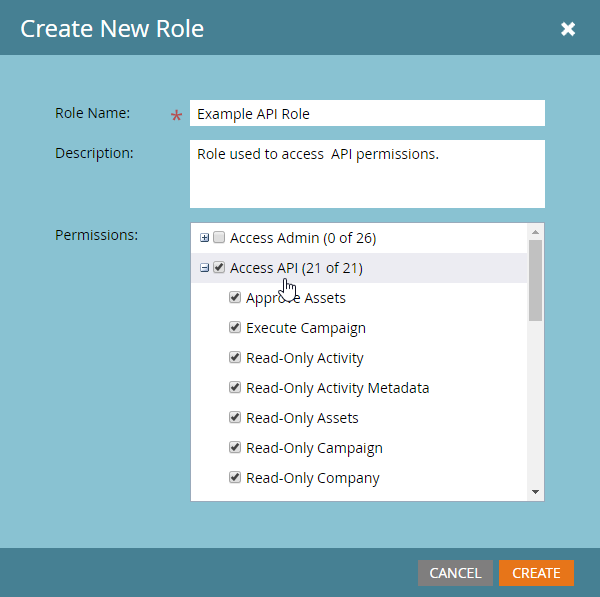

# 사용자 정의 서비스

사용자 지정 서비스는 Marketo으로 인증하기 위한 자격 증명을 제공합니다. Marketo [ID 서비스](https://developer.adobe.com/marketo-apis/api/identity/#tag/Identity/operation/identityUsingGET)에서 액세스 토큰을 가져오려면 자격 증명이 필요합니다. 각 사용자 지정 서비스의 범위는 권한을 파생시키는 단일 API 전용 사용자로 지정됩니다.

## 역할

사용자 지정 서비스를 만드는 첫 번째 단계는 관련 API 전용 사용자에게 적용할 수 있는 역할을 만드는 것입니다. 이 작업은 **[!UICONTROL Admin]** > **[!UICONTROL Users & Roles]** > **[!UICONTROL Roles]** 메뉴에서 수행됩니다.

역할은 특정 기능에 대한 액세스를 허용하거나 제한하는 개별 권한을 위한 컨테이너입니다. 작업 공간 및 분할 영역이 활성화된 가입에서는 작업 공간별로 권한이 부여됩니다. 사용자가 한 작업 영역에서 권한을 가지고 있지만 다른 작업 영역에서는 권한을 가지고 있지 않은 경우 해당 작업 영역에서만 허가된 작업을 수행할 수 있습니다. 역할을 만들려면 새 역할 단추를 클릭합니다.

역할에 설명적인 이름을 지정해야 합니다. API 전용 사용자에게는 일반 사용자 권한과 구별되는 특정 권한 세트가 있습니다. API 권한은 &quot;Access API&quot; 트리 아래의 자체 계층에 있습니다.

### 역할 권한

&quot;액세스 API&quot; 그룹의 권한만 API 사용자에게 적용됩니다. 즉, 모든 관리자 권한을 부여하면 사용자에게 API 권한이 부여되지 않습니다.

역할을 구성할 때 이를 사용하는 애플리케이션이 어떤 작업을 수행하도록 허용해야 하는지 신중히 고려하십시오. 이러한 작업을 수행하는 데 필요한 최소 권한 집합만 부여합니다. 불필요하게 허용된 권한 집합을 허용하면 통합이 구독에서 원치 않는 작업을 수행할 수 있습니다. [권한 도구](endpoint-reference.md)를 사용하여 최소 권한 집합을 결정할 수 있습니다. [권한](#permission_list)의 전체 목록을 확인하세요.

## 사용자

역할을 만든 후에는 &#39;API 전용&#39; 사용자를 만들어야 합니다. API 전용 사용자는 다른 사용자가 관리하므로 Marketo에서 특별한 유형의 사용자이며 Marketo에 로그인하는 데 사용할 수 없습니다. API 전용 사용자는 다음과 같은 작업을 수행할 수 있습니다.

- 사용자 정의 서비스 만들기
- 해당 서비스에 대한 권한 범위
- REST API 액세스

>[!MORELIKETHIS]
>
>API 전용 사용자를 만들려면 **[!UICONTROL Admin]** > **[!UICONTROL Users & Roles]** > **[!UICONTROL Users]** 메뉴로 이동한 다음 [!UICONTROL Invite New User]을(를) 클릭합니다.

사용할 서비스 및 애플리케이션에 따라 사용자를 설명하는 이름과 이메일 주소(올바르지 않음)를 지정합니다. 대화 상자 메뉴에서 필수 필드를 입력하고 &quot;API만&quot; 확인란을 클릭한 다음 API 역할 중 하나를 사용자에게 부여합니다. 이렇게 하면 해당 역할의 권한 세트가 사용자에게 할당됩니다.

마지막으로 &quot;전송&quot;을 클릭하여 API 전용 사용자를 만듭니다.

자격 증명을 사용하여 새 애플리케이션을 프로비저닝할 때 다른 기존 통합과 동일한 권한이 설정되어 있더라도 서비스에 대해 새 사용자를 만드는 것이 좋습니다. API 호출 사용량 통계 및 오류는 사용자별로 추적되므로, 각 애플리케이션에 대해 사용자를 프로비저닝하면 특정 애플리케이션에 대한 사용량 및 문제를 분리하는 데 도움이 됩니다. 일별 API 호출 제한에 도달하는 데 문제가 있거나 통합에서 API 호출로 인해 오류가 발생하는 경우 유용합니다.

## 사용자 정의 서비스

사용자 지정 서비스는 Marketo 인스턴스로 인증을 수행하는 데 필요한 실제 자격 증명, 클라이언트 ID 및 클라이언트 암호를 제공합니다. 프로비전하려면 **[!UICONTROL Admin]** > **[!UICONTROL Integrations]** > **[!UICONTROL LaunchPoint]** 메뉴로 이동한 다음 **[!UICONTROL New Service]**&#x200B;을(를) 선택합니다.

서비스에 수사적 이름을 지정하고 &quot;서비스&quot; 목록에서 &quot;사용자 정의&quot;를 선택합니다. 서비스에 자세한 설명을 제공하고 API 전용 사용자 목록에서 적절한 사용자를 선택한 다음 [!UICONTROL Create]을(를) 클릭합니다.

이렇게 하면 LaunchPoint 서비스 목록에 새 서비스가 추가되고 &quot;세부 정보 보기&quot; 옵션이 추가됩니다. &quot;세부 정보 보기&quot;를 클릭하면 인증에 필요한 클라이언트 ID와 클라이언트 암호, 소유 사용자 및 단기 테스트를 위한 토큰 가져오기 옵션이 제공됩니다. 이 대화 상자에서 가져온 토큰은 [ID 서비스](https://developer.adobe.com/marketo-apis/api/identity/#tag/Identity/operation/identityUsingGET)에서 일반적으로 가져온 토큰과 수명이 동일하며 만든 후 3,600초 동안 유효합니다.

## 작업 공간 및 파티션

작업 영역 및 분할 영역이 있는 가입에서 지정된 레코드나 에셋에 액세스하는 기능은 지정된 작업 영역에서 사용자 역할이 갖는 권한에 따라 부여됩니다. 각 작업공간에는 작업공간 및 분할 영역 메뉴의 하나 이상의 분할 영역에 대한 액세스 권한이 부여되며 리드는 단일 분할 영역에 속합니다. API 전용 사용자가 작업 영역에서 리드 레코드를 읽거나 쓸 수 있는 액세스 권한이 있는 경우 해당 작업 영역이 액세스할 수 있는 파티션의 모든 레코드에 액세스할 수 있습니다.

Assets은 작업 공간에 속하므로, 에셋을 읽거나 쓸 수 있는 기능은 사용자가 작업 공간에서 해당 유형의 에셋 레코드를 읽거나 쓸 수 있는 권한이 있는 관련 작업 공간에서 역할을 가지고 있는지 여부에 따라 결정됩니다.

## 권한 목록

다음은 API 전용 사용자가 사용할 수 있는 모든 권한 목록과 해당 권한이 있는 사용자가 수행할 수 있는 작업입니다.

| 역할 권한 | 다음에 대한 액세스 권한 부여... |
| --- | --- |
| Assets 승인 | 에셋 승인 |
| 캠페인 실행 | 캠페인 요청 또는 예약 |
| 읽기 전용 활동 | 리드 활동 검색 |
| 읽기 전용 활동 메타데이터 | 리드 활동 메타데이터 검색 |
| 읽기 전용 Assets | 자산 세부 정보 검색 |
| 읽기 전용 캠페인 | 캠페인 세부 정보 가져오기 |
| 읽기 전용 회사 | 회사 세부 정보 검색 |
| 읽기 전용 사용자 지정 개체 | 사용자 지정 개체 세부 정보 가져오기 |
| 읽기 전용 리드 | 리드 세부 정보 검색 |
| 읽기 전용 명명된 계정 | 명명된 계정 세부 정보 검색 |
| 읽기 전용 명명된 계정 목록 | 명명된 계정 목록 세부 정보 검색 |
| 읽기 전용 영업 기회 | 영업 기회 세부 정보 가져오기 |
| 읽기 전용 영업 담당자 | 영업 담당자 세부 정보 가져오기 |
| 읽기-쓰기 활동 | 리드 활동 검색 및 만들기 |
| 읽기-쓰기 활동 메타데이터 | 리드 활동 메타데이터 검색 및 만들기 |
| Assets 읽기-쓰기 | 에셋 검색, 생성 및 업데이트 |
| 캠페인 읽기-쓰기 | 캠페인 검색, 생성 및 업데이트 |
| 읽기-쓰기 회사 | 회사 검색, 생성 및 업데이트 |
| 사용자 지정 개체 읽기-쓰기 | 사용자 지정 개체 검색, 생성 및 업데이트 |
| 리드 읽기-쓰기 | 리드 세부 정보 검색, 생성 및 업데이트 |
| 명명된 계정 읽기-쓰기 | 명명 계정 검색, 생성 및 업데이트 |
| 명명된 계정 목록 읽기-쓰기 | 명명된 계정 목록 검색, 만들기 및 업데이트 |
| 읽기-쓰기 영업 기회 | 기회 검색, 생성 및 업데이트 |
| 읽기-쓰기 영업 담당자 | 영업 직원 검색, 생성 및 업데이트 |
