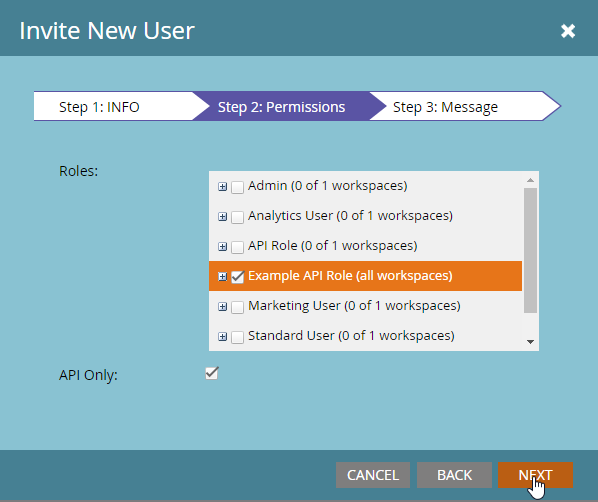

# REST API

Marketo은 시스템 기능 중 대부분을 원격으로 실행할 수 있도록 하는 REST API를 노출합니다. 프로그램 제작에서 리드 일괄 가져오기에 이르기까지 Marketo 인스턴스를 세밀하게 제어할 수 있는 많은 옵션이 있습니다.

이러한 API는 일반적으로 다음과 같은 두 가지 광범위한 범주로 분류됩니다. [잠재 고객 데이터베이스](https://developer.adobe.com/marketo-apis/api/mapi/), 및 [자산](https://developer.adobe.com/marketo-apis/api/asset/). 잠재 고객 데이터베이스 API를 통해 Marketo 개인 레코드 및 관련 객체 유형(예: Opportunity 및 Company)을 검색하고 상호 작용할 수 있습니다. 에셋 API를 사용하면 마케팅 자료 및 워크플로우 관련 레코드와 상호 작용할 수 있습니다.

- **일일 할당량:** 구독에는 하루에 50,000개의 API 호출이 할당됩니다(매일 오전 12시(CST)에 재설정됨). 계정 관리자를 통해 일일 할당량을 늘릴 수 있습니다.
- **속도 제한:** 인스턴스당 API 액세스는 20초당 100개 호출로 제한되었습니다.
- **동시 실행 제한:**  최대 10개의 동시 API 호출.

표준 호출의 크기는 URI 길이 8KB, 본문 크기가 1MB로 제한되지만 본문은 벌크 API의 경우 10MB일 수 있습니다. 호출에 오류가 있는 경우 API는 일반적으로 상태 코드 200을 반환하지만 JSON 응답에는 값이 인 &quot;성공&quot; 멤버가 포함됩니다. `false`및 &quot;오류&quot; 멤버의 오류 배열 오류에 대한 자세한 정보 [여기](error-codes.md).

## 시작하기

다음 단계에는 Marketo 인스턴스에서 관리자 권한이 필요합니다.

Marketo에 대한 첫 번째 호출의 경우 잠재 고객 레코드를 검색합니다. Marketo 작업을 시작하려면 인스턴스에 대해 인증된 호출을 수행하기 위한 API 자격 증명을 획득해야 합니다. 인스턴스에 로그인하고 로 이동합니다. **[!UICONTROL Admin]** -> **[!UICONTROL Users and Roles]**.


다음을 클릭합니다. **[!UICONTROL Roles]** 을 탭한 다음 새 역할을 선택하고 Access API 그룹의 역할에 최소 &quot;읽기 전용 리드&quot;(또는 &quot;읽기 전용 사용자&quot;) 권한을 할당합니다. 수사적 이름을 지정하고 다음을 클릭하십시오. **[!UICONTROL Create]**.


이제 다음으로 돌아가기 [!UICONTROL Users] tab 키를 누른 다음 클릭 **[!UICONTROL Invite New User]**. API 사용자임을 나타내는 수사적 이름과 이메일 주소를 지정하고 을(를) 클릭합니다. **[!UICONTROL Next]**.


그런 다음 [!UICONTROL API Only] 옵션을 설정하고, 만든 API 역할을 사용자에게 부여하고, **[!UICONTROL Next]**.



사용자 만들기 프로세스를 완료하려면 **[!UICONTROL Send]**.


다음으로 이동 [!UICONTROL Admin] 메뉴 및 클릭 **[!UICONTROL LaunchPoint]**.


다음을 클릭합니다. **[!UICONTROL New]** 메뉴 및 선택 **[!UICONTROL New Service]**. 서비스에 수사적 이름을 지정하고 **[!UICONTROL Custom]** 다음에서 [!UICONTROL Service] 드롭다운 메뉴. 설명을 지정한 다음 [!UICONTROL API Only User] 드롭다운 메뉴 및 클릭 **[!UICONTROL Create]**.


클릭 **[!UICONTROL View Details]** 새 서비스에서 클라이언트 ID 및 클라이언트 암호에 액세스할 수 있습니다. 지금은 다음을 클릭할 수 있습니다 **[!UICONTROL Get Token]** 1시간 동안 유효한 액세스 토큰을 생성하기 위한 버튼입니다. 지금은 메모에 토큰을 저장합니다.


다음으로 이동 **[!UICONTROL Admin]** 메뉴, 다음으로 **[!UICONTROL Web Services]**.


다음 찾기 [!UICONTROL Endpoint] REST API 상자에 를 저장하고 지금은 노트에 저장합니다.


새 브라우저 탭을 열고 호출에 적절한 정보를 사용하여 다음을 입력합니다. [필터 유형별 리드 가져오기](https://developer.adobe.com/marketo-apis/api/mapi/#tag/Leads/operation/getLeadsByFilterUsingGET):

```
<Your Endpoint URL>/rest/v1/leads.json?access_token=<Your Access Token>&filterType=email&filterValues=<Your Email Address>
```

데이터베이스에 전자 메일 주소가 있는 잠재 고객 레코드가 없는 경우, 해당 레코드가 있는 것으로 대체하십시오. URL 막대에서 enter 키를 누르면 다음과 유사한 JSON 응답을 다시 받아야 합니다.

```json
{
    "requestId":"c493#1511ca2b184",
    "result":[
       {
           "id":1,
           "updatedAt":"2015-08-24T20:17:23Z",
           "lastName":"Elkington",
           "email":"developerfeedback@marketo.com",
           "createdAt":"2013-02-19T23:17:04Z",
           "firstName":"Kenneth"
        }
    ],
    "success":true
}
```

## API 사용 정보

각 API 사용자는 API 사용 보고서에 개별적으로 보고되므로, 사용자별로 웹 서비스를 분할하면 각 통합의 사용을 쉽게 고려할 수 있습니다. 인스턴스에 대한 API 호출 수가 제한을 초과하여 후속 호출이 실패하는 경우 이 방법을 사용하면 각 서비스의 볼륨을 고려하고 문제를 해결하는 방법을 평가할 수 있습니다. 로 이동하여 사용 방법 보기 **[!UICONTROL Admin]** -> **[!UICONTROL Integration]** > **[!UICONTROL Web Services]** 지난 7일 동안의 호출 수를 클릭합니다.
