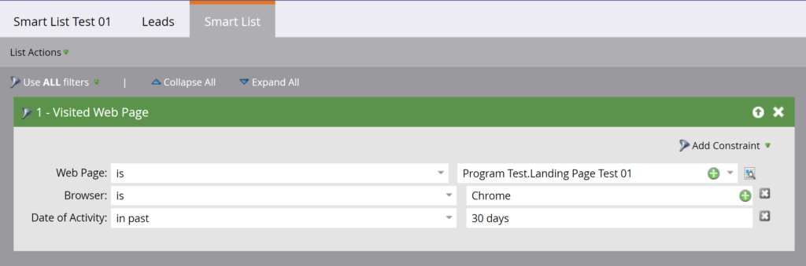

# 스마트 목록

[스마트 목록 끝점 참조](https://developer.adobe.com/marketo-apis/api/asset#tag/Smart-Lists)

스마트 목록 REST API를 사용하여 스마트 목록을 쿼리, 복제 및 삭제합니다.

이러한 API는 사용자가 만든 스마트 목록만 지원합니다. [기본 제공 또는 시스템 스마트 목록](https://experienceleague.adobe.com/en/docs/marketo/using/product-docs/core-marketo-concepts/smart-lists-and-static-lists/using-smart-lists/use-built-in-system-smart-lists)을 지원하지 않습니다.

## 쿼리

[ID별](https://developer.adobe.com/marketo-apis/api/asset#tag/Smart-Lists/operation/getSmartListByIdUsingGET), [이름별](https://developer.adobe.com/marketo-apis/api/asset#tag/Smart-Lists/operation/getSmartListByNameUsingGET) 또는 [검색](https://developer.adobe.com/marketo-apis/api/asset#tag/Smart-Lists/operation/getSmartListsUsingGET)별로 스마트 목록을 쿼리합니다.

### ID별

[ID별 쿼리](https://developer.adobe.com/marketo-apis/api/asset#tag/Smart-Lists/operation/getSmartListByIdUsingGET)에서 스마트 목록 `id` 경로 매개 변수 하나를 사용하고 일치하는 레코드를 반환합니다. 스마트 목록 규칙을 포함하도록 선택적 `includeRules` 부울 매개 변수를 설정하십시오.



```http
GET /rest/asset/v1/smartList/{id}.json?includeRules=true
```

```json
{
    "success": true,
    "errors": [],
    "requestId": "6efc#16c8967a21f",
    "warnings": [],
    "result": [
        {
            "id": 4363,
            "name": "Smart List Test 01",
            "createdAt": "2019-06-03T23:01:13Z+0000",
            "updatedAt": "2019-06-04T17:37:45Z+0000",
            "url": "https://app-sjqe.marketo.com/#SL4363A1LA1",
            "folder": {
                "id": 1041,
                "type": "Program"
            },
            "workspace": "Default",
            "rules": {
                "filterMatchType": "all",
                "triggers": [],
                "filters": [
                    {
                        "id": 459,
                        "name": "Visited Web Page",
                        "ruleTypeId": 1,
                        "ruleType": "Activity",
                        "operator": "occurs",
                        "conditions": [
                            {
                                "activityAttributeId": 1,
                                "activityAttributeName": "Web Page",
                                "operator": "is",
                                "values": [
                                    "Program Test.Landing Page Test 01"
                                ],
                                "isPrimary": true
                            },
                            {
                                "activityAttributeId": 6,
                                "activityAttributeName": "Browser",
                                "operator": "is",
                                "values": [
                                    "Chrome"
                                ],
                                "isPrimary": false
                            },
                            {
                                "activityAttributeId": -101,
                                "activityAttributeName": "Date of Activity",
                                "operator": "in past",
                                "values": [
                                    "30 days"
                                ],
                                "isPrimary": false
                            }
                        ]
                    }
                ]
            }
        }
    ]
}
```

### 스마트 캠페인 ID별

[스마트 캠페인 ID별 쿼리](https://developer.adobe.com/marketo-apis/api/asset#tag/Smart-Campaigns/operation/getSmartListBySmartCampaignIdUsingGET)는 하나의 스마트 캠페인 `id` 경로 매개 변수를 사용하고 해당 스마트 목록 레코드를 반환합니다. 스마트 목록 규칙을 포함하도록 선택적 `includeRules` 부울 매개 변수를 설정하십시오.

```http
GET /rest/asset/v1/smartCampaign/{smartCampaignId}/smartList.json
```

```json
{
    "success": true,
    "errors": [],
    "requestId": "6efc#16c8967a21f",
    "warnings": [],
    "result": [
        {
            "id": 4363,
            "name": "Smart List Test 01",
            "createdAt": "2019-06-03T23:01:13Z+0000",
            "updatedAt": "2019-06-04T17:37:45Z+0000",
            "url": "https://app-sjqe.marketo.com/#SL4363A1LA1",
            "folder": {
                "id": 1041,
                "type": "Program"
            },
            "workspace": "Default"
         }
    ]
}
```

### 프로그램 ID별

[프로그램 ID별 쿼리](https://developer.adobe.com/marketo-apis/api/asset#tag/Programs/operation/getSmartListByProgramIdUsingGET)는 하나의 전자 메일 프로그램 `id` 경로 매개 변수를 사용하고 해당 스마트 목록 레코드를 반환합니다. 스마트 목록 규칙을 포함하도록 선택적 `includeRules` 부울 매개 변수를 설정하십시오.

```http
GET /rest/asset/v1/program/{programId}/smartList.json
```

```json
{
    "success": true,
    "errors": [],
    "requestId": "6efc#16c8967a21f",
    "warnings": [],
    "result": [
        {
            "id": 4363,
            "name": "Smart List Test 01",
            "createdAt": "2019-06-03T23:01:13Z+0000",
            "updatedAt": "2019-06-04T17:37:45Z+0000",
            "url": "https://app-sjqe.marketo.com/#SL4363A1LA1",
            "folder": {
                "id": 1041,
                "type": "Program"
            },
            "workspace": "Default"
         }
    ]
}
```

### 이름별

[이름별 쿼리](https://developer.adobe.com/marketo-apis/api/asset#tag/Smart-Lists/operation/getSmartListByNameUsingGET)에서 스마트 목록 `name` 매개 변수를 사용합니다. 끝점은 정확한 이름 일치를 수행하고 일치하는 레코드를 반환합니다.

```http
GET /rest/asset/v1/smartList/byName.json?name=2018 Leads
```

```json
{
    "success": true,
    "errors": [],
    "requestId": "115d7#16423bc13b4",
    "result": [
        {
            "id": 283988,
            "name": "2018 Leads",
            "createdAt": "2008-10-07T15:20:39Z+0000",
            "updatedAt": "2010-04-13T15:34:32Z+0000",
            "url": "https://app-abm.marketo.com/#SL283988A1",
            "folder": {
                "id": 31,
                "type": "Folder"
            },
            "workspace": "Default"
        }
    ]
}
```

### 찾아보기

찾아보기 끝점을 사용하여 [스마트 목록을 일괄적으로 검색](https://developer.adobe.com/marketo-apis/api/asset#tag/Smart-Lists/operation/getSmartListsUsingGET)하십시오. 선택적 `folder` 매개 변수는 쿼리의 범위를 부모 폴더로 지정합니다. `id` 및 `type`이(가) 포함된 JSON 개체로 전달합니다.

페이지 매김에 `offset` 및 `maxReturn`을(를) 사용합니다. 선택적 `earliestUpdatedAt` 및 `latestUpdatedAt` 매개 변수를 사용하여 `updatedAt` 날짜 범위별로 필터링하십시오.

```http
GET /rest/asset/v1/smartLists.json?folder={"id":31,"type":"Folder"}
```

```json
{
    "success": true,
    "errors": [],
    "requestId": "9aa4#16423c0e969",
    "result": [
        {
            "id": 283988,
            "name": "2018 Leads",
            "createdAt": "2008-10-07T15:20:39Z+0000",
            "updatedAt": "2010-04-13T15:34:32Z+0000",
            "url": "https://app-abm.marketo.com/#SL283988A1",
            "folder": {
                "id": 31,
                "type": "Folder"
            },
            "workspace": "Default"
        },
        {
            "id": 299697,
            "name": "Active Prospects",
            "createdAt": "2008-10-17T02:09:49Z+0000",
            "updatedAt": "2010-03-27T18:27:46Z+0000",
            "url": "https://app-abm.marketo.com/#SL299697A1",
            "folder": {
                "id": 31,
                "type": "Folder"
            },
            "workspace": "Default"
        },
        {
            "id": 400517,
            "name": "Leads by Score",
            "createdAt": "2009-01-07T18:52:52Z+0000",
            "updatedAt": "2010-04-13T15:36:09Z+0000",
            "url": "https://app-abm.marketo.com/#SL400517A1",
            "folder": {
                "id": 31,
                "type": "Folder"
            },
            "workspace": "Default"
        }
    ]
}
```

## 복제

[스마트 목록 복제](https://developer.adobe.com/marketo-apis/api/asset#tag/Smart-Lists/operation/cloneSmartListUsingPOST)에 `application/x-www-form-urlencoded` POST 요청을 보냅니다. `id` 경로 매개 변수는 원본 스마트 목록을 식별합니다.

`id` 및 `type`이(가) 포함된 JSON 개체로 `folder`을(를) 전달합니다. 상위는 프로그램 또는 스마트 목록 폴더여야 합니다. `name`은(는) 고유해야 합니다. 선택적 `description` 매개 변수는 새 목록을 설명합니다.

```http
POST /rest/asset/v1/smartList/{id}/clone.json
```

```text
Content-Type: application/x-www-form-urlencoded
```

```text
folder={"id":31,"type":"Folder"}&name=2018 Leads Qualified
```

```json
{
    "success": true,
    "errors": [],
    "requestId": "a672#16423d755ed",
    "result": [
        {
            "id": 788645,
            "name": "2018 Leads Qualified",
            "createdAt": "2018-06-21T19:34:32Z+0000",
            "updatedAt": "2018-06-21T19:34:32Z+0000",
            "url": "https://app-abm.marketo.com/#SL788645A1",
            "folder": {
                "id": 31,
                "type": "Folder"
            },
            "workspace": "Default"
        }
    ]
}
```

## 삭제

[스마트 목록을 삭제](https://developer.adobe.com/marketo-apis/api/asset#tag/Smart-Lists/operation/deleteSmartListByIdUsingPOST)하려면 `id`을(를) 경로 매개 변수로 전달하십시오.

```http
POST /rest/asset/v1/smartList/{id}/delete.json
```

```json
{
    "success": true,
    "errors": [],
    "requestId": "8f5#16423dd0fbe",
    "result": [
        {
            "id": 788645
        }
    ]
}
```
