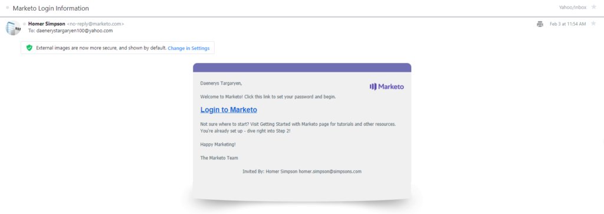

# 사용자 관리

[사용자 관리 끝점 참조](https://developer.adobe.com/marketo-apis/api/user/)

Marketo에서는 Marketo의 사용자 레코드에 대해 CRUD 작업을 수행할 수 있도록 해주는 일련의 사용자 관리 엔드포인트를 제공합니다. 사용자는 사용자에게 초대를 보낸 후 암호를 설정하고 Marketo에 처음 액세스함으로써 만들어집니다.

다른 Marketo REST API와 달리 사용자 관리 API를 사용할 경우:

- 인증할 액세스 토큰을 전송하려면 HTTP 헤더 메서드를 사용해야 합니다. 액세스 토큰을 쿼리 문자열 매개 변수로 전달할 수 없습니다. 인증에 대한 자세한 내용은 [여기](authentication.md)를 참조하세요.
- REST API용 [사용자 지정 서비스](https://experienceleague.adobe.com/ko/docs/marketo/using/product-docs/administration/additional-integrations/create-a-custom-service-for-use-with-rest-api)에 대한 사용자 역할을 만들 때 두 개의 다른 그룹에서 역할 권한을 선택해야 합니다.
   1. [관리자 액세스](https://experienceleague.adobe.com/ko/docs/marketo/using/product-docs/administration/users-and-roles/descriptions-of-role-permissions) 그룹의 &quot;사용자 액세스&quot; 권한
   1. [API 액세스](https://experienceleague.adobe.com/ko/docs/marketo/using/product-docs/administration/users-and-roles/descriptions-of-role-permissions) 그룹에서 &quot;사용자 관리 Api 액세스&quot;
- 응답 본문에는 호출의 성공 또는 실패를 나타내는 &quot;success&quot; 부울 속성이 포함되어 있지 않습니다. 대신 HTTP 응답 상태 코드를 평가해야 합니다. 호출이 성공하면 200 상태 코드가 반환됩니다. 호출이 실패하면 200개가 아닌 수준 상태 코드가 반환되고 응답 본문에 오류 코드와 설명 오류 메시지가 있는 표준 &quot;오류&quot; 배열이 포함됩니다.
- 날짜/시간 문자열의 형식은 `yyyyMMdd'T'HH:mm:ss.SSS't'+|-hhmm`입니다. 이는 `createdAt`, `updatedAt`, `expiresAt` 특성에 적용됩니다.
- 사용자 관리 API 엔드포인트에는 다른 엔드포인트와 같이 &quot;/rest&quot; 접두사가 붙지 않습니다.

## 쿼리

사용자 관리를 위한 쿼리 지원에는 모든 사용자, 역할 및 작업 공간을 검색할 수 있는 기능이 포함됩니다. 또한 사용자 ID로 단일 사용자 레코드를 검색하거나 사용자 ID로 역할/작업 영역 레코드를 검색할 수 있습니다.

### ID별 사용자

[ID별 사용자 가져오기](https://developer.adobe.com/marketo-apis/api/user/#tag/User-Management/operation/getUserUsingGET) 끝점은 단일 `userid` 경로 매개 변수를 사용하고 초대를 수락한 사용자에 대해 단일 사용자 레코드를 반환합니다.

```
GET /userservice/management/v1/users/{userid}/user.json
```

```json
{
  "userid": "jamie@houselannister.com",
  "firstName": "Jamie",
  "lastName": "Lannister",
  "emailAddress": "jamie@lannister.com",
  "optedIn": false,
  "failedLogins": 0,
  "failedDeviceCode": 0,
  "isLocked": false,
  "lockedReason": null,
  "id": 0,
  "apiOnly": false,
  "userRoleWorkspaces": [
    {
      "accessRoleId": 1,
      "accessRoleName": "Admin",
      "workspaceId": 0,
      "workspaceName": "AllZones"
    },
    {
      "accessRoleId": 2,
      "accessRoleName":
      "Standard User",
      "workspaceId": 1008,
      "workspaceName": "World"
    }
  ],
  "expiresAt": "2020-12-31T08:00:00.000t+0000",
  "lastLoginAt": "2020-02-05T01:02:23.000t+0000"
}
```

### ID로 초대된 사용자

[ID로 초대된 사용자 가져오기](https://developer.adobe.com/marketo-apis/api/user/#tag/User-Management/operation/getInvitedUserUsingGET) 끝점은 단일 `userid` 경로 매개 변수를 사용하고 &quot;보류 중인&quot; 사용자에 대해 단일 사용자 레코드를 반환합니다(초대를 아직 수락하지 않음).

```
GET /userservice/management/v1/users/{userid}/invite.json
```

```json
{
    "id": 25112,
    "firstName": "Jamie",
    "lastName": "Lannister",
    "emailAddress": "jamie@lannister.com",
    "userId": "jamie@lannister.com",
    "subscriptionId": 3381,
    "status": "pending",
    "expiresAt": "20200807T20:49:54.0t+0000",
    "createdAt": "20200731T20:49:54.0t+0000",
    "updatedAt": "20200731T20:49:54.0t+0000"
}
```

### Id별 역할 및 작업 공간

[ID별 역할 및 작업 공간 가져오기](https://developer.adobe.com/marketo-apis/api/user/#tag/User-Management/operation/getUserRolesAndWorkspacesUsingGET) 끝점은 단일 `userid` 경로 매개 변수를 사용하고 사용자 역할 및 작업 공간 레코드 목록을 반환합니다. 응답에는 지정된 사용자의 역할 및 작업 공간 ID와 이름을 포함하는 하나의 오브젝트가 있는 배열이 포함됩니다.

```
GET /userservice/management/v1/users/{userid}/roles.json
```

```json
[
  {
    "accessRoleId": 1,
    "accessRoleName": "Admin",
    "workspaceId": 0,
    "workspaceName": "AllZones"
  },
  {
    "accessRoleId": 2,
    "accessRoleName": "Standard User",
    "workspaceId": 1008,
    "workspaceName": "World"
  }
]
```

### 사용자 찾아보기

[사용자 가져오기](https://developer.adobe.com/marketo-apis/api/user/#tag/User-Management/operation/getUsersUsingGET) 끝점이 모든 사용자 레코드 목록을 반환합니다. 선택적 `pageSize` 매개 변수는 반환할 최대 항목 수를 지정하는 정수입니다. 기본값은 20입니다. 최대값은 200입니다. 선택적 `pageOffset` 매개 변수는 항목 검색을 시작할 위치를 지정하는 정수입니다. `pageSize`에 사용할 수 있습니다. 기본값은 0입니다.

```
GET /userservice/management/v1/users/allusers.json
```

```json
[
  {
    "userid": "jamie@lannister.com",
    "firstName": "Jamie",
    "lastName": "Lannister",
    "emailAddress": "jamie@houselannister.com",
    "id": 6785,
    "apiOnly": false
  },
  {
    "userid": "jeoffery@housebaratheon.com",
    "firstName": "Jeoffery",
    "lastName": "Baratheon",
    "emailAddress": "jeoffery@housebaratheon.com",
    "id": 7718,
    "apiOnly": false
  },
  {
    "userid": "rickon@housestark.com",
    "firstName": "Rickon",
    "lastName": "Stark",
    "emailAddress": "rickon@housestark.com",
    "id": 8612,
    "apiOnly": false
  }
]
```

>[!NOTE]
>
>위의 코드 샘플에서 표시되는 `userid`은(는) Adobe IMS로 마이그레이션된 고객을 위한 것입니다. 아직 마이그레이션하지 않은 고객은 `userid` 필드에 일반 전자 메일 주소를 볼 수 있습니다.

### 역할 찾아보기

[역할 가져오기](https://developer.adobe.com/marketo-apis/api/user/#tag/User-Management/operation/getRolesUsingGET) 끝점이 모든 역할 레코드 목록을 반환합니다.

```
GET /userservice/management/v1/users/roles.json
```

```json
[
    {
        "id": 1,
        "name": "Admin",
        "description": "All permissions",
        "type": "system",
        "hidden": false,
        "onlyAllZones": true,
        "createdAt": "20100327T18:27:42.0t+0000",
        "updatedAt": "20100327T18:27:42.0t+0000"
    },
    {
        "id": 2,
        "name": "Standard User",
        "description": "All permissions except Admin",
        "type": "system",
        "hidden": false,
        "onlyAllZones": false,
        "createdAt": "20100327T18:27:42.0t+0000",
        "updatedAt": "20180423T02:33:29.0t+0000"
    },
    {
        "id": 24,
        "name": "RTP Launcher",
        "description": "Role required for launcher in RTP",
        "type": "system",
        "hidden": false,
        "onlyAllZones": false,
        "createdAt": "20151024T01:45:40.0t+0000",
        "updatedAt": "20171024T23:41:24.0t+0000"
    },
    {
        "id": 25,
        "name": "RTP Editor",
        "description": "Role required for editor in RTP",
        "type": "system",
        "hidden": false,
        "onlyAllZones": false,
        "createdAt": "20151024T01:45:40.0t+0000",
        "updatedAt": "20171024T23:41:24.0t+0000"
    },
    {
        "id": 101,
        "name": "Analytics User",
        "description": "Has access to Analytics",
        "type": "custom",
        "hidden": false,
        "onlyAllZones": false,
        "createdAt": "20100327T18:27:42.0t+0000",
        "updatedAt": "20180423T02:33:29.0t+0000"
    },
    {
        "id": 102,
        "name": "Marketing User",
        "description": "All permissions except Admin",
        "type": "custom",
        "hidden": false,
        "onlyAllZones": false,
        "createdAt": "20100327T18:27:42.0t+0000",
        "updatedAt": "20100327T18:27:42.0t+0000"
    },
    {
        "id": 103,
        "name": "Web Designer",
        "description": "Has access to Design Studio except approval permission",
        "type": "custom",
        "hidden": false,
        "onlyAllZones": false,
        "createdAt": "20100327T18:27:42.0t+0000",
        "updatedAt": "20180423T02:33:29.0t+0000"
    }
]
```

### 작업 영역 찾아보기

[작업 영역 가져오기](https://developer.adobe.com/marketo-apis/api/user/#tag/User-Management/operation/getWorkspacesUsingGET) 끝점이 모든 작업 영역 레코드 목록을 반환합니다.

```
GET /userservice/management/v1/users/workspaces.json
```

```json
[
  {
    "id": 1,
    "name": "Default",
    "description": "Initial workspace for Marketing Activities, Design Studio, and so on.",
    "globalViz": 0,
    "status": "active",
    "currencyInfo": null,
    "createdAt": "20160910T23:08:05.0t+0000",
    "updatedAt": "20160910T23:08:05.0t+0000"
  },
  {
    "id": 1008,
    "name": "World",
    "description": "",
    "globalViz": 0,
    "status": "active",
    "currencyInfo": null,
    "createdAt": "20181119T21:59:36.0t+0000",
    "updatedAt": "20181119T21:59:36.0t+0000"
  },
  {
    "id": 1009,
    "name": "Reproduction - US English - All Leads",
    "description": "A Workspace for recreating customer-reported problems.",
    "globalViz": 1,
    "status": "active",
    "currencyInfo": null,
    "createdAt": "20190129T23:36:37.0t+0000",
    "updatedAt": "20190129T23:36:37.0t+0000"
  },
  {
    "id": 1010,
    "name": "US",
    "description": "United States - Qualified Leads",
    "globalViz": 0,
    "status": "active",
    "currencyInfo": null,
    "createdAt": "20190322T15:55:40.0t+0000",
    "updatedAt": "20190322T15:55:40.0t+0000"
  }
]
```

## 사용자 초대

[Adobe IMS 통합 구독](https://experienceleague.adobe.com/ko/docs/marketo/using/product-docs/administration/marketo-with-adobe-identity/adobe-identity-management-overview)에서 이 끝점은 [API 전용 사용자](https://experienceleague.adobe.com/ko/docs/marketo/using/product-docs/administration/users-and-roles/create-an-api-only-user)의 초대를 지원합니다. [표준 사용자](https://experienceleague.adobe.com/ko/docs/marketo/using/product-docs/administration/users-and-roles/managing-marketo-users)를 초대하려면 대신 [Adobe 사용자 관리 API](https://developer.adobe.com/umapi/)를 사용하십시오.

[사용자 초대](https://developer.adobe.com/marketo-apis/api/user/#tag/User-Management/operation/inviteUserUsingPOST) 끝점을 사용하여 &quot;Marketo 시작&quot; 전자 메일 초대를 새 사용자에게 보냅니다. 이메일 본문에는 사용자가 Marketo에 처음 액세스할 수 있는 &quot;Marketo에 로그인&quot; 링크가 포함되어 있습니다. 초대를 수락하기 위해 이메일 수신자는 &quot;Marketo에 로그인&quot; 링크를 클릭하고 암호를 만들며 Marketo에 액세스할 수 있습니다. 수락 프로세스가 완료될 때까지 초대가 &quot;보류 중&quot;이며 사용자 레코드를 편집할 수 없습니다. 보류 중인 초대는 보낸 후 7일 후에 만료됩니다. 사용자 관리에 대한 자세한 내용은 [여기](https://experienceleague.adobe.com/ko/docs/marketo/using/product-docs/administration/users-and-roles/managing-marketo-users)를 참조하세요.

매개 변수가 요청 본문에 `application/json` 형식으로 전달됩니다.

다음 매개 변수가 필요합니다.  `emailAddress`, `firstName`, `lastName, userRoleWorkspaces`. `userRoleWorkspaces` 매개 변수는 `accessRoleId` 및 `workspaceId` 특성을 포함하는 개체 배열입니다.

`userid` 매개 변수는 사용자 로그인 용도로 사용되는 고유한 사용자 식별자 문자열 값이며 전자 메일 주소 형식이어야 합니다. 요청에 제공되지 않은 경우 `userid`의 값은 기본적으로 `emailAddress` 매개 변수에 제공된 값으로 설정됩니다.

부울 `apiOnly` 매개 변수는 사용자가 [API 전용 사용자](https://experienceleague.adobe.com/ko/docs/marketo/using/product-docs/administration/users-and-roles/create-an-api-only-user)인지 여부를 지정합니다. `expiresAt` 매개 변수는 사용자 로그인이 만료되는 시기를 지정하며 W3C ISO-8601 형식(밀리초 없음)을 사용하여 형식이 지정됩니다. 요청에 제공되지 않으면 사용자가 만료되지 않습니다. `reason` 매개 변수는 사용자 초대의 이유를 설명하는 문자열입니다.

성공하면 끝점이 &quot;true&quot; 값을 반환하고, 그렇지 않으면 오류 메시지가 반환됩니다.

```
POST /userservice/management/v1/users/invite.json
```

```
Content-Type: application/json
```

```json
{
  "emailAddress": "daenerys@housetargaryen.com",
  "firstName": "Daenerys",
  "lastName": "Targaryen",
  "expiresAt": "2020-12-31T23:59:59-05:00",
  "reason": "Keeper of dragons",
  "userRoleWorkspaces": [
    {
      "accessRoleId": 1,
      "workspaceId": 0
    }
  ]
}
```

```
true
```

다음은 새 사용자에게 전송된 &quot;Marketo 시작&quot; 이메일 초대의 예입니다. 이메일 제목란은 &quot;Marketo 로그인 정보&quot;이고, 발신자는 [REST API 사용자 정의 서비스](https://experienceleague.adobe.com/ko/docs/marketo/using/product-docs/administration/additional-integrations/create-a-custom-service-for-use-with-rest-api)와(과) 연결된 API 전용 사용자의 이메일 주소이며, 수신자는 firstName, lastName 및 emailAddress 매개 변수를 통해 지정된 대로 지정됩니다.



사용자가 암호를 두 번 입력하고 &quot;암호 만들기&quot; 버튼을 클릭하여 이메일 초대를 수락합니다. 그런 다음 처음으로 Marketo에 대한 액세스 권한이 부여됩니다.

## 사용자 업데이트

사용자에 대한 업데이트 지원에는 사용자 속성을 업데이트하거나 사용자를 삭제하는 기능이 포함됩니다. 초대를 수락한 사용자만 업데이트할 수 있습니다. 속성은 애플리케이션/json 형식으로 요청 본문의 매개 변수로 전달됩니다.

### 사용자 속성 업데이트

[Adobe IMS 통합 구독](https://experienceleague.adobe.com/ko/docs/marketo/using/product-docs/administration/marketo-with-adobe-identity/adobe-identity-management-overview)에서 이 끝점은 [API 전용 사용자](https://experienceleague.adobe.com/ko/docs/marketo/using/product-docs/administration/users-and-roles/create-an-api-only-user)의 특성 업데이트만 지원합니다. [표준 사용자](https://experienceleague.adobe.com/ko/docs/marketo/using/product-docs/administration/users-and-roles/managing-marketo-users)의 특성을 업데이트하려면 대신 [Adobe 사용자 관리 API](https://developer.adobe.com/umapi/)를 사용하십시오.

[사용자 특성 업데이트](https://developer.adobe.com/marketo-apis/api/user/#tag/User-Management/operation/updateUserAttributeUsingPOST) 끝점은 단일 `userid` 경로 매개 변수를 사용하고 단일 사용자 레코드를 반환합니다. 요청 본문에 업데이트할 사용자 특성 `emailAddress`, `firstName`, `lastName`, `expiresAt`이(가) 하나 이상 있습니다.

```
POST /userservice/management/v1/users/{userid}/update.json
```

```
Content-Type: application/json
```

```json
{
  "firstName": "JAMIE",
  "lastName": "LANISTER",
  "expiresAt": "20211231T08:00:00.000t+0000"
}
```

```json
{
  "userid": "jamie@houselannister.com",
  "firstName": "JAMIE",
  "lastName": "LANISTER",
  "emailAddress": "jamie@houselannister.com",
  "optedIn": false,
  "failedLogins": 0,
  "failedDeviceCode": 0,
  "isLocked": false,
  "lockedReason": null,
  "id": 0,
  "apiOnly": false,
  "userRoleWorkspaces": [
    {
      "accessRoleId": 1,
      "accessRoleName": "Admin",
      "workspaceId": 0,
      "workspaceName": "AllZones"
    },
    {
      "accessRoleId": 2,
      "accessRoleName":
      "Standard User",
      "workspaceId": 1008,
      "workspaceName": "World"
    }
  ],
  "expiresAt": "2021-12-31T08:00:00.000t+0000"
  "lastLoginAt": "2020-02-05T01:02:23.000t+0000"
}
```

#### 사용자 삭제

[Adobe IMS 통합 구독](https://experienceleague.adobe.com/ko/docs/marketo/using/product-docs/administration/marketo-with-adobe-identity/adobe-identity-management-overview)에서 이 끝점은 [API 전용 사용자](https://experienceleague.adobe.com/ko/docs/marketo/using/product-docs/administration/users-and-roles/create-an-api-only-user)의 삭제만 지원합니다. [표준 사용자](https://experienceleague.adobe.com/ko/docs/marketo/using/product-docs/administration/users-and-roles/managing-marketo-users)를 삭제하려면 대신 [Adobe 사용자 관리 API](https://developer.adobe.com/umapi/)를 사용하십시오.

[사용자 삭제](https://developer.adobe.com/marketo-apis/api/user/#tag/User-Management/operation/deleteUserUsingPOST) 끝점은 단일 `userid` 경로 매개 변수를 사용하고 해당 사용자를 인스턴스에서 삭제합니다. 이는 파괴적인 삭제이며 되돌릴 수 없습니다. 성공하면 200 상태 코드가 반환되고 그렇지 않으면 오류 메시지가 반환됩니다.

```
POST /userservice/management/v1/users/{userid}/delete.json
```

#### 초대된 사용자 삭제

[초대된 사용자 삭제](https://developer.adobe.com/marketo-apis/api/user/#tag/User-Management/operation/deleteInvitedUserUsingPOST) 끝점은 단일 `userid` 경로 매개 변수를 사용하고 인스턴스에서 해당 &quot;보류 중인&quot; 사용자를 삭제합니다(사용자가 초대를 아직 수락하지 않음). 이는 파괴적인 삭제이며 되돌릴 수 없습니다. 성공하면 200 상태 코드가 반환되고 그렇지 않으면 오류 메시지가 반환됩니다.

```
POST /userservice/management/v1/users/{userid}/invite/delete.json
```

## 역할 업데이트

역할 업데이트 지원에는 역할을 추가하고 삭제하는 기능이 포함됩니다. 속성은 요청 본문을 application/json 형식으로 매개 변수로 전달됩니다.

## 역할 추가

[역할 추가](https://developer.adobe.com/marketo-apis/api/user/#tag/User-Management/operation/addRolesUsingPOST) 끝점은 단일 `userid` 경로 매개 변수를 사용하고 해당 사용자에 하나 이상의 사용자 역할을 추가합니다. 요청 본문에는 각 개체에 포함된 하나 이상의 개체 목록이 포함되어 있습니다.  `accessRoleId` 및 `workspaceId` 특성입니다. 성공하면 지정된 사용자에 대한 `accessRoleId/workspaceId`쌍의 전체 목록이 반환됩니다.

```
POST /userservice/management/v1/users/{userid}/roles/create.json
```

```
Content-Type: application/json
```

```json
[
  {
    "accessRoleId": 2,
    "workspaceId": 1008
  }
]
```

```json
[
  {
    "accessRoleId": 1,
    "accessRoleName": "Admin",
    "workspaceId": 0,
    "workspaceName": "AllZones"
  },
  {
    "accessRoleId": 2,
    "accessRoleName": "Standard User",
    "workspaceId": 1008,
    "workspaceName": "World"
  }
]
```

## 역할 삭제

[역할 삭제](https://developer.adobe.com/marketo-apis/api/user/#tag/User-Management/operation/deleteRolesUsingPOST) 끝점은 단일 `userid` 경로 매개 변수를 사용하고 해당 사용자에서 하나 이상의 사용자 역할을 삭제합니다. 요청 본문에는 각 개체에 포함된 하나 이상의 개체 목록이 포함되어 있습니다.  `accessRoleId` 및 `workspaceId` 특성입니다. 성공하면 지정된 사용자의 나머지 accessRoleId/workspaceId 쌍 목록이 반환됩니다.

```
POST /userservice/management/v1/users/{userid}/roles/delete.json
```

```
Content-Type: application/json
```

```json
[
  {
    "accessRoleId": 2,
    "workspaceId": 1008
  }
]
```

```json
[
  {
    "accessRoleId": 1,
    "accessRoleName": "Admin",
    "workspaceId": 0,
    "workspaceName": "AllZones"
  }
]
```
