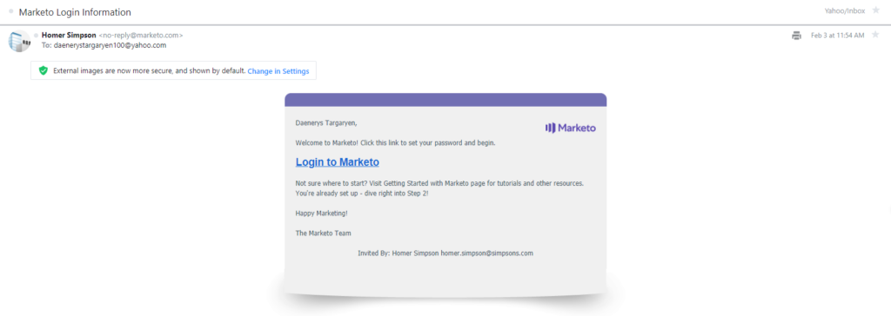

# 사용자 관리

[사용자 관리 끝점 참조](https://developer.adobe.com/marketo-apis/api/user/)

Marketo 사용자 관리 엔드포인트는 사용자 레코드에 대한 CRUD 작업을 수행합니다. 사용자를 만들려면 초대를 보냅니다. 그런 다음 사용자는 암호를 설정하고 Marketo에 처음으로 액세스합니다.

다른 Marketo REST API와 달리 사용자 관리 API를 사용할 경우:

- HTTP 헤더에서 액세스 토큰을 전송합니다. 액세스 토큰을 쿼리-문자열 매개 변수로 전달할 수 없습니다. [인증 가이드](authentication.md)를 참조하세요.
- REST API [사용자 지정 서비스](https://experienceleague.adobe.com/en/docs/marketo/using/product-docs/administration/additional-integrations/create-a-custom-service-for-use-with-rest-api)에 대한 사용자 역할을 만들 때 다음 각 그룹에서 권한을 선택하십시오.
  1. [관리자 액세스](https://experienceleague.adobe.com/en/docs/marketo/using/product-docs/administration/users-and-roles/descriptions-of-role-permissions) 그룹의 &quot;사용자 액세스&quot; 권한
  1. [API 액세스](https://experienceleague.adobe.com/en/docs/marketo/using/product-docs/administration/users-and-roles/descriptions-of-role-permissions) 그룹에서 &quot;사용자 관리 Api 액세스&quot;
- 응답 본문에는 &quot;success&quot; 부울 속성이 포함되어 있지 않으므로 HTTP 응답 상태 코드를 평가합니다. 성공적인 호출은 상태 코드 200을 반환합니다. 실패한 호출은 200이 아닌 상태 코드와 오류 코드 및 설명 메시지와 함께 표준 &quot;오류&quot; 배열을 반환합니다.
- 날짜/시간 문자열의 형식을 `yyyyMMdd'T'HH:mm:ss.SSS't'+|-hhmm`(으)로 지정합니다. 이 형식은 `createdAt`, `updatedAt` 및 `expiresAt`에 적용됩니다.
- 사용자 관리 API 엔드포인트에 &quot;/rest&quot;로 접두사를 추가하지 마십시오.

## 쿼리

사용자 관리 쿼리는 모든 사용자, 역할 및 작업 공간을 검색할 수 있습니다. 또한 사용자 ID별로 한 명의 사용자 또는 연결된 역할 및 작업 공간 레코드를 검색할 수 있습니다.

### ID별 사용자

[ID별 사용자 가져오기](https://developer.adobe.com/marketo-apis/api/user/#tag/User-Management/operation/getUserUsingGET) 끝점은 단일 `userid` 경로 매개 변수를 사용하고 초대를 수락한 사용자에 대해 단일 사용자 레코드를 반환합니다.

```http
GET /userservice/management/v1/users/{userid}/user.json
```

```json
{
  "userid": "jamie@houselannister.com",
  "firstName": "Jamie",
  "lastName": "Lannister",
  "emailAddress": "jamie@lannister.com",
  "optedIn": false,
  "failedLogins": 0,
  "failedDeviceCode": 0,
  "isLocked": false,
  "lockedReason": null,
  "id": 0,
  "apiOnly": false,
  "userRoleWorkspaces": [
    {
      "accessRoleId": 1,
      "accessRoleName": "Admin",
      "workspaceId": 0,
      "workspaceName": "AllZones"
    },
    {
      "accessRoleId": 2,
      "accessRoleName":
      "Standard User",
      "workspaceId": 1008,
      "workspaceName": "World"
    }
  ],
  "expiresAt": "2020-12-31T08:00:00.000t+0000",
  "lastLoginAt": "2020-02-05T01:02:23.000t+0000"
}
```

### ID로 초대된 사용자

[ID로 초대된 사용자 가져오기](https://developer.adobe.com/marketo-apis/api/user/#tag/User-Management/operation/getInvitedUserUsingGET) 끝점은 단일 `userid` 경로 매개 변수를 사용하고 &quot;보류 중인&quot; 사용자에 대해 단일 사용자 레코드를 반환합니다(초대를 아직 수락하지 않음).

```http
GET /userservice/management/v1/users/{userid}/invite.json
```

```json
{
    "id": 25112,
    "firstName": "Jamie",
    "lastName": "Lannister",
    "emailAddress": "jamie@lannister.com",
    "userId": "jamie@lannister.com",
    "subscriptionId": 3381,
    "status": "pending",
    "expiresAt": "20200807T20:49:54.0t+0000",
    "createdAt": "20200731T20:49:54.0t+0000",
    "updatedAt": "20200731T20:49:54.0t+0000"
}
```

### Id별 역할 및 작업 공간

[ID별 역할 및 작업 공간 가져오기](https://developer.adobe.com/marketo-apis/api/user/#tag/User-Management/operation/getUserRolesAndWorkspacesUsingGET) 끝점은 하나의 `userid` 경로 매개 변수를 사용하고 사용자의 역할 및 작업 공간 레코드를 반환합니다. 응답 배열의 각 객체에는 역할 및 작업 공간 ID와 이름이 포함됩니다.

```http
GET /userservice/management/v1/users/{userid}/roles.json
```

```json
[
  {
    "accessRoleId": 1,
    "accessRoleName": "Admin",
    "workspaceId": 0,
    "workspaceName": "AllZones"
  },
  {
    "accessRoleId": 2,
    "accessRoleName": "Standard User",
    "workspaceId": 1008,
    "workspaceName": "World"
  }
]
```

### 사용자 찾아보기

[사용자 가져오기](https://developer.adobe.com/marketo-apis/api/user/#tag/User-Management/operation/getUsersUsingGET) 끝점이 모든 사용자 레코드를 반환합니다. 다음과 같은 선택적 정수 매개 변수를 지원합니다.

- `pageSize`은(는) 반환할 최대 항목 수를 지정합니다. 기본값은 20이고 최대값은 200입니다.
- `pageOffset`은(는) 항목 검색을 시작할 위치를 지정합니다. 기본값은 0이며 `pageSize`과(와) 함께 사용할 수 있습니다.

```http
GET /userservice/management/v1/users/allusers.json
```

```json
[
  {
    "userid": "jamie@lannister.com",
    "firstName": "Jamie",
    "lastName": "Lannister",
    "emailAddress": "jamie@houselannister.com",
    "id": 6785,
    "apiOnly": false
  },
  {
    "userid": "jeoffery@housebaratheon.com",
    "firstName": "Jeoffery",
    "lastName": "Baratheon",
    "emailAddress": "jeoffery@housebaratheon.com",
    "id": 7718,
    "apiOnly": false
  },
  {
    "userid": "rickon@housestark.com",
    "firstName": "Rickon",
    "lastName": "Stark",
    "emailAddress": "rickon@housestark.com",
    "id": 8612,
    "apiOnly": false
  }
]
```

>[!NOTE]
>
>위의 코드 샘플에서 표시되는 `userid`은(는) Adobe IMS로 마이그레이션된 고객을 위한 것입니다. 아직 마이그레이션하지 않은 고객은 `userid` 필드에 일반 전자 메일 주소를 볼 수 있습니다.

### 역할 찾아보기

[역할 가져오기](https://developer.adobe.com/marketo-apis/api/user/#tag/User-Management/operation/getRolesUsingGET) 끝점이 모든 역할 레코드 목록을 반환합니다.

```http
GET /userservice/management/v1/users/roles.json
```

```json
[
    {
        "id": 1,
        "name": "Admin",
        "description": "All permissions",
        "type": "system",
        "hidden": false,
        "onlyAllZones": true,
        "createdAt": "20100327T18:27:42.0t+0000",
        "updatedAt": "20100327T18:27:42.0t+0000"
    },
    {
        "id": 2,
        "name": "Standard User",
        "description": "All permissions except Admin",
        "type": "system",
        "hidden": false,
        "onlyAllZones": false,
        "createdAt": "20100327T18:27:42.0t+0000",
        "updatedAt": "20180423T02:33:29.0t+0000"
    },
    {
        "id": 24,
        "name": "RTP Launcher",
        "description": "Role required for launcher in RTP",
        "type": "system",
        "hidden": false,
        "onlyAllZones": false,
        "createdAt": "20151024T01:45:40.0t+0000",
        "updatedAt": "20171024T23:41:24.0t+0000"
    },
    {
        "id": 25,
        "name": "RTP Editor",
        "description": "Role required for editor in RTP",
        "type": "system",
        "hidden": false,
        "onlyAllZones": false,
        "createdAt": "20151024T01:45:40.0t+0000",
        "updatedAt": "20171024T23:41:24.0t+0000"
    },
    {
        "id": 101,
        "name": "Analytics User",
        "description": "Has access to Analytics",
        "type": "custom",
        "hidden": false,
        "onlyAllZones": false,
        "createdAt": "20100327T18:27:42.0t+0000",
        "updatedAt": "20180423T02:33:29.0t+0000"
    },
    {
        "id": 102,
        "name": "Marketing User",
        "description": "All permissions except Admin",
        "type": "custom",
        "hidden": false,
        "onlyAllZones": false,
        "createdAt": "20100327T18:27:42.0t+0000",
        "updatedAt": "20100327T18:27:42.0t+0000"
    },
    {
        "id": 103,
        "name": "Web Designer",
        "description": "Has access to Design Studio except approval permission",
        "type": "custom",
        "hidden": false,
        "onlyAllZones": false,
        "createdAt": "20100327T18:27:42.0t+0000",
        "updatedAt": "20180423T02:33:29.0t+0000"
    }
]
```

### 작업 영역 찾아보기

[작업 영역 가져오기](https://developer.adobe.com/marketo-apis/api/user/#tag/User-Management/operation/getWorkspacesUsingGET) 끝점이 모든 작업 영역 레코드 목록을 반환합니다.

```http
GET /userservice/management/v1/users/workspaces.json
```

```json
[
  {
    "id": 1,
    "name": "Default",
    "description": "Initial workspace for Marketing Activities, Design Studio, and so on.",
    "globalViz": 0,
    "status": "active",
    "currencyInfo": null,
    "createdAt": "20160910T23:08:05.0t+0000",
    "updatedAt": "20160910T23:08:05.0t+0000"
  },
  {
    "id": 1008,
    "name": "World",
    "description": "",
    "globalViz": 0,
    "status": "active",
    "currencyInfo": null,
    "createdAt": "20181119T21:59:36.0t+0000",
    "updatedAt": "20181119T21:59:36.0t+0000"
  },
  {
    "id": 1009,
    "name": "Reproduction - US English - All Leads",
    "description": "A Workspace for recreating customer-reported problems.",
    "globalViz": 1,
    "status": "active",
    "currencyInfo": null,
    "createdAt": "20190129T23:36:37.0t+0000",
    "updatedAt": "20190129T23:36:37.0t+0000"
  },
  {
    "id": 1010,
    "name": "US",
    "description": "United States - Qualified Leads",
    "globalViz": 0,
    "status": "active",
    "currencyInfo": null,
    "createdAt": "20190322T15:55:40.0t+0000",
    "updatedAt": "20190322T15:55:40.0t+0000"
  }
]
```

## 사용자 초대

[Adobe IMS 통합 구독](https://experienceleague.adobe.com/ko/docs/marketo/using/product-docs/administration/marketo-with-adobe-identity/adobe-identity-management-overview)에서 이 끝점은 [API 전용 사용자](https://experienceleague.adobe.com/en/docs/marketo/using/product-docs/administration/users-and-roles/create-an-api-only-user)의 초대를 지원합니다. [표준 사용자](https://experienceleague.adobe.com/en/docs/marketo/using/product-docs/administration/users-and-roles/managing-marketo-users)를 초대하려면 대신 [Adobe 사용자 관리 API](https://developer.adobe.com/umapi/)를 사용하십시오.

[사용자 초대](https://developer.adobe.com/marketo-apis/api/user/#tag/User-Management/operation/inviteUserUsingPOST) 끝점이 새 사용자에게 &quot;Marketo 시작&quot; 전자 메일 초대를 보냅니다. 이메일에는 &quot;Marketo에 로그인&quot; 링크가 포함되어 있습니다. 수신자는 링크를 선택하고 암호를 생성한 다음 Marketo에 액세스할 수 있습니다.

수신자가 초대를 수락할 때까지 상태는 &quot;보류 중&quot;이며 사용자 레코드를 편집할 수 없습니다. 보류 중인 초대는 전송 후 7일 후에 만료됩니다. 자세한 내용은 [Marketo 사용자 관리 설명서](https://experienceleague.adobe.com/en/docs/marketo/using/product-docs/administration/users-and-roles/managing-marketo-users)를 참조하세요.

요청 본문의 매개 변수를 `application/json` 형식으로 전달합니다.

필수 매개 변수는 `emailAddress`, `firstName`, `lastName` 및 `userRoleWorkspaces`입니다. `userRoleWorkspaces` 매개 변수는 `accessRoleId` 및 `workspaceId` 특성을 포함하는 개체 배열입니다.

`userid` 매개 변수는 로그인에 사용되는 고유한 사용자 식별자이며 전자 메일 주소 형식이어야 합니다. 요청에서 `userid`을(를) 생략하면 기본값은 `emailAddress`입니다.

부울 `apiOnly` 매개 변수는 사용자가 [API 전용 사용자](https://experienceleague.adobe.com/en/docs/marketo/using/product-docs/administration/users-and-roles/create-an-api-only-user)인지 여부를 지정합니다. `expiresAt` 매개 변수는 사용자 로그인이 만료되는 시기를 지정하고 밀리초 없이 W3C ISO-8601 형식을 사용합니다. 요청이 `expiresAt`을(를) 생략하면 사용자가 만료되지 않습니다. `reason` 매개 변수는 초대의 이유를 설명합니다.

초대가 성공하면 끝점이 &quot;true&quot;를 반환합니다. 그렇지 않으면 오류 메시지가 반환됩니다.

```http
POST /userservice/management/v1/users/invite.json
```

```text
Content-Type: application/json
```

```json
{
  "emailAddress": "daenerys@housetargaryen.com",
  "firstName": "Daenerys",
  "lastName": "Targaryen",
  "expiresAt": "2020-12-31T23:59:59-05:00",
  "reason": "Keeper of dragons",
  "userRoleWorkspaces": [
    {
      "accessRoleId": 1,
      "workspaceId": 0
    }
  ]
}
```

```text
true
```

다음 이미지는 새 사용자에게 전송된 &quot;Marketo에 오신 것을 환영합니다.&quot; 이메일을 보여줍니다. 제목은 &quot;Marketo 로그인 정보&quot;입니다. 보낸 사람은 [REST API 사용자 지정 서비스](https://experienceleague.adobe.com/en/docs/marketo/using/product-docs/administration/additional-integrations/create-a-custom-service-for-use-with-rest-api)와(과) 연결된 API 전용 사용자의 전자 메일 주소입니다. firstName, lastName 및 emailAddress 매개 변수는 수신자를 지정합니다.



사용자가 암호를 두 번 입력하고 &quot;CREATE PASSWORD&quot; 버튼을 선택하여 초대를 수락합니다. 그런 다음 사용자는 Marketo에 대한 액세스 권한을 받습니다.

## 사용자 업데이트

사용자가 초대를 수락한 후 사용자 속성을 업데이트하거나 사용자를 삭제할 수 있습니다. 속성을 요청 본문의 매개 변수로 application/json 형식으로 전달합니다.

### 사용자 속성 업데이트

[Adobe IMS 통합 구독](https://experienceleague.adobe.com/ko/docs/marketo/using/product-docs/administration/marketo-with-adobe-identity/adobe-identity-management-overview)에서 이 끝점은 [API 전용 사용자](https://experienceleague.adobe.com/en/docs/marketo/using/product-docs/administration/users-and-roles/create-an-api-only-user)의 특성 업데이트만 지원합니다. [표준 사용자](https://experienceleague.adobe.com/en/docs/marketo/using/product-docs/administration/users-and-roles/managing-marketo-users)의 특성을 업데이트하려면 대신 [Adobe 사용자 관리 API](https://developer.adobe.com/umapi/)를 사용하십시오.

[사용자 특성 업데이트](https://developer.adobe.com/marketo-apis/api/user/#tag/User-Management/operation/updateUserAttributeUsingPOST) 끝점은 단일 `userid` 경로 매개 변수를 사용하고 단일 사용자 레코드를 반환합니다. 요청 본문에 업데이트할 사용자 특성 `emailAddress`, `firstName`, `lastName`, `expiresAt`이(가) 하나 이상 있습니다.

```http
POST /userservice/management/v1/users/{userid}/update.json
```

```text
Content-Type: application/json
```

```json
{
  "firstName": "JAMIE",
  "lastName": "LANISTER",
  "expiresAt": "20211231T08:00:00.000t+0000"
}
```

```json
{
  "userid": "jamie@houselannister.com",
  "firstName": "JAMIE",
  "lastName": "LANISTER",
  "emailAddress": "jamie@houselannister.com",
  "optedIn": false,
  "failedLogins": 0,
  "failedDeviceCode": 0,
  "isLocked": false,
  "lockedReason": null,
  "id": 0,
  "apiOnly": false,
  "userRoleWorkspaces": [
    {
      "accessRoleId": 1,
      "accessRoleName": "Admin",
      "workspaceId": 0,
      "workspaceName": "AllZones"
    },
    {
      "accessRoleId": 2,
      "accessRoleName":
      "Standard User",
      "workspaceId": 1008,
      "workspaceName": "World"
    }
  ],
  "expiresAt": "2021-12-31T08:00:00.000t+0000"
  "lastLoginAt": "2020-02-05T01:02:23.000t+0000"
}
```

#### 사용자 삭제

[Adobe IMS 통합 구독](https://experienceleague.adobe.com/ko/docs/marketo/using/product-docs/administration/marketo-with-adobe-identity/adobe-identity-management-overview)에서 이 끝점은 [API 전용 사용자](https://experienceleague.adobe.com/en/docs/marketo/using/product-docs/administration/users-and-roles/create-an-api-only-user)의 삭제만 지원합니다. [표준 사용자](https://experienceleague.adobe.com/en/docs/marketo/using/product-docs/administration/users-and-roles/managing-marketo-users)를 삭제하려면 대신 [Adobe 사용자 관리 API](https://developer.adobe.com/umapi/)를 사용하십시오.

[사용자 삭제](https://developer.adobe.com/marketo-apis/api/user/#tag/User-Management/operation/deleteUserUsingPOST) 끝점은 단일 `userid` 경로 매개 변수를 사용하고 해당 사용자를 인스턴스에서 삭제합니다. 이는 파괴적인 삭제이며 되돌릴 수 없습니다. 성공하면 200 상태 코드가 반환되고 그렇지 않으면 오류 메시지가 반환됩니다.

```http
POST /userservice/management/v1/users/{userid}/delete.json
```

#### 초대된 사용자 삭제

[초대된 사용자 삭제](https://developer.adobe.com/marketo-apis/api/user/#tag/User-Management/operation/deleteInvitedUserUsingPOST) 끝점은 단일 `userid` 경로 매개 변수를 사용하고 인스턴스에서 해당 &quot;보류 중인&quot; 사용자를 삭제합니다(사용자가 초대를 아직 수락하지 않음). 이는 파괴적인 삭제이며 되돌릴 수 없습니다. 성공하면 200 상태 코드가 반환되고 그렇지 않으면 오류 메시지가 반환됩니다.

```http
POST /userservice/management/v1/users/{userid}/invite/delete.json
```

## 역할 업데이트

역할을 추가하거나 삭제할 수 있습니다. 속성을 요청 본문의 매개 변수로 application/json 형식으로 전달합니다.

## 역할 추가

[역할 추가](https://developer.adobe.com/marketo-apis/api/user/#tag/User-Management/operation/addRolesUsingPOST) 끝점은 단일 `userid` 경로 매개 변수를 사용하고 해당 사용자에 하나 이상의 사용자 역할을 추가합니다. 요청 본문에는 `accessRoleId` 및 `workspaceId` 특성을 각각 포함하는 하나 이상의 개체 목록이 포함되어 있습니다. 성공하면 지정된 사용자에 대한 `accessRoleId/workspaceId`쌍의 전체 목록이 반환됩니다.

```http
POST /userservice/management/v1/users/{userid}/roles/create.json
```

```text
Content-Type: application/json
```

```json
[
  {
    "accessRoleId": 2,
    "workspaceId": 1008
  }
]
```

```json
[
  {
    "accessRoleId": 1,
    "accessRoleName": "Admin",
    "workspaceId": 0,
    "workspaceName": "AllZones"
  },
  {
    "accessRoleId": 2,
    "accessRoleName": "Standard User",
    "workspaceId": 1008,
    "workspaceName": "World"
  }
]
```

## 역할 삭제

[역할 삭제](https://developer.adobe.com/marketo-apis/api/user/#tag/User-Management/operation/deleteRolesUsingPOST) 끝점은 단일 `userid` 경로 매개 변수를 사용하고 해당 사용자에서 하나 이상의 사용자 역할을 삭제합니다. 요청 본문에는 `accessRoleId` 및 `workspaceId` 특성을 각각 포함하는 하나 이상의 개체 목록이 포함되어 있습니다. 성공하면 지정된 사용자의 나머지 accessRoleId/workspaceId 쌍 목록이 반환됩니다.

```http
POST /userservice/management/v1/users/{userid}/roles/delete.json
```

```text
Content-Type: application/json
```

```json
[
  {
    "accessRoleId": 2,
    "workspaceId": 1008
  }
]
```

```json
[
  {
    "accessRoleId": 1,
    "accessRoleName": "Admin",
    "workspaceId": 0,
    "workspaceName": "AllZones"
  }
]
```
