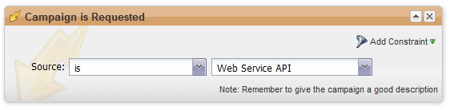

# request캠페인

이 함수는 Marketo 스마트 캠페인에서 기존 Marketo 리드를 실행합니다. 스마트 캠페인에는 웹 서비스 API 소스가 있는 &quot;캠페인이 요청됨&quot; 트리거가 있어야 합니다(아래 참조).



사용할 수 있는 매개 변수 세트는 두 개입니다. 첫 번째 사례는 를 사용하는 것입니다. `campaignName` + `programName` + `programTokenList`. 다음 `programTokenList` 이 경우 은(는) 비워둘 수 있습니다. 두 번째 경우는 를 사용하는 것입니다. `campaignId` 혼자요 다른 모든 조합은 잘못된 매개 변수 예외를 발생시킵니다.

참고: 호출당 100개의 leadKey 값 제한. 추가 키는 무시됩니다.

| 필드 이름 | 필수/선택 사항 | 설명 |
| --- | --- | --- |
| leadList->leadKey->keyType | 필수 | `keyType` 잠재 고객을 쿼리할 필드를 지정할 수 있습니다. 가능한 값은 다음과 같습니다.`IDNUM`, `EMAIL`, `SFDCLEADID`, `LEADOWNEREMAIL`, `SFDCACCOUNTID`, `SFDCCONTACTID`, `SFDCLEADID`, `SFDCLEADOWNERID`, `SFDCOPPTYID` |
| leadList->leadKey->keyValue | 필수 | `keyValue` 는 잠재 고객을 쿼리할 값입니다. |
| 소스 | 필수 | 캠페인 소스. 가능한 값: `MKTOWS` 또는 `SALES`. 열거형은 WSDL에서 정의됩니다. |
| campaignId | 선택 사항인 경우 `campaignName`, `programName`, 및 `programTokenList` 는 매개 변수 사이트에 함께 있고, 그렇지 않으면 `campaignId` 필수 | 캠페인 ID. 참고: 다음 경우에 잘못된 매개변수 오류가 발생합니다. `campaignID` 및 `campaignName` 둘 다 전달되었습니다. |
| campaignName | campaignId가 있는 경우 선택 사항이며, 그렇지 않은 경우 세트로 필수입니다. `campaignName`, programName 및 programTokenList | 캠페인 이름 |
| programName | campaignId가 있는 경우 선택 사항이며, 그렇지 않은 경우 세트로 필수입니다. `campaignName`, programName 및 programTokenList | 프로그램 이름 |
| 프로그램 토큰 목록 | campaignId가 있는 경우 선택 사항이며, 그렇지 않은 경우 세트로 필수입니다. `campaignName`, `programName`, 및 `programTokenList` | 캠페인에 사용할 토큰 배열입니다. 토큰을 지정할 때 programName 및 `campaignName` 필수 항목입니다. |
| programTokenList->attrib->name | 선택 사항 | 값을 전달할 프로그램 토큰의 이름입니다. 예:{{my.message}} |
| programTokenList->attrib->value | 선택 사항 | 지정된 토큰 이름의 값입니다. |

## 요청 XML

```xml
<?xml version="1.0" encoding="UTF-8"?>
<SOAP-ENV:Envelope xmlns:SOAP-ENV="http://schemas.xmlsoap.org/soap/envelope/" xmlns:ns1="http://www.marketo.com/mktows/">
  <SOAP-ENV:Header>
    <ns1:AuthenticationHeader>
      <mktowsUserId>demo17_1_809939944BFABAE58E5D27</mktowsUserId>
      <requestSignature>48397ad47b71a1439f13a51eea3137df46441979</requestSignature>
      <requestTimestamp>2013-08-01T12:31:14-07:00</requestTimestamp>
    </ns1:AuthenticationHeader>
  </SOAP-ENV:Header>
  <SOAP-ENV:Body>
    <ns1:paramsRequestCampaign>
      <source>MKTOWS</source>
      <campaignId>4496</campaignId>
      <leadList>
        <leadKey>
          <keyType>EMAIL</keyType>
          <keyValue>lead@company.com</keyValue>
        </leadKey>
        <leadKey>
          <keyType>EMAIL</keyType>
          <keyValue>anotherlead@company.com</keyValue>
        </leadKey>
      </leadList>
    </ns1:paramsRequestCampaign>
  </SOAP-ENV:Body>
</SOAP-ENV:Envelope>
```

## 응답 XML

```xml
<?xml version="1.0" encoding="UTF-8"?>
<SOAP-ENV:Envelope xmlns:SOAP-ENV="http://schemas.xmlsoap.org/soap/envelope/" xmlns:ns1="http://www.marketo.com/mktows/">
  <SOAP-ENV:Body>
    <ns1:successRequestCampaign>
      <result>
        <success>true</success>
      </result>
    </ns1:successRequestCampaign>
  </SOAP-ENV:Body>
</SOAP-ENV:Envelope>
```

## 샘플 코드 - PHP

```php
 <?php
 
  $debug = true;
 
  $marketoSoapEndPoint     = "";  // CHANGE ME
  $marketoUserId           = "";  // CHANGE ME
  $marketoSecretKey        = "";  // CHANGE ME
  $marketoNameSpace        = "http://www.marketo.com/mktows/";
 
  // Create Signature
  $dtzObj = new DateTimeZone("America/Los_Angeles");
  $dtObj  = new DateTime('now', $dtzObj);
  $timeStamp = $dtObj->format(DATE_W3C);
  $encryptString = $timeStamp . $marketoUserId;
  $signature = hash_hmac('sha1', $encryptString, $marketoSecretKey);
 
  // Create SOAP Header
  $attrs = new stdClass();
  $attrs->mktowsUserId = $marketoUserId;
  $attrs->requestSignature = $signature;
  $attrs->requestTimestamp = $timeStamp;
  $authHdr = new SoapHeader($marketoNameSpace, 'AuthenticationHeader', $attrs);
  $options = array("connection_timeout" => 20, "location" => $marketoSoapEndPoint);
  if ($debug) {
    $options["trace"] = true;
  }
 
  // Create Request
  $leadKey = array("keyType" => "EMAIL", "keyValue" => "lead@company.com");
  $leadKey2 = array("keyType" => "EMAIL&qquot;, "keyValue" => "anotherlead@company.com");
 
  $leadList = new stdClass();
  $leadList->leadKey = array($leadKey, $leadKey2);
 
  $source = "MKTOWS";
  $campaignId = "4496";
 
  $paramsRequestCampaign = new stdClass();
  $paramsRequestCampaign->campaignId = $campaignId;
  $paramsRequestCampaign->source = $source;
  $paramsRequestCampaign->leadList = $leadList;
 
  $params = array("paramsRequestCampaign" => $paramsRequestCampaign);
 
  $soapClient = new SoapClient($marketoSoapEndPoint ."?WSDL", $options);
  try {
    $response = $soapClient->__soapCall('requestCampaign', $params, $options, $authHdr);
  }
  catch(Exception $ex) {
    var_dump($ex);
  }
  if ($debug) {
    print "RAW request:\n" .$soapClient->__getLastRequest() ."\n";
    print "RAW response:\n" .$soapClient->__getLastResponse() ."\n";
  }
  print_r($response);
?>
```

## 샘플 코드 - Java

```java
import com.marketo.mktows.*;
 
import java.net.URL;
import javax.xml.namespace.QName;
import java.text.DateFormat;
import java.text.SimpleDateFormat;
import java.util.Date;
import javax.crypto.Mac;
import javax.crypto.spec.SecretKeySpec;
import org.apache.commons.codec.binary.Hex;
import javax.xml.bind.JAXBContext;
import javax.xml.bind.JAXBElement;
import javax.xml.bind.Marshaller;
 
 
public class RequestCampaign {
 
    public static void main(String[] args) {
        System.out.println("Executing Request Campaign");
        try {
            URL marketoSoapEndPoint = new URL("CHANGE ME" + "?WSDL");
            String marketoUserId = "CHANGE ME";
            String marketoSecretKey = "CHANGE ME";
             
            QName serviceName = new QName("http://www.marketo.com/mktows/", "MktMktowsApiService");
            MktMktowsApiService service = new MktMktowsApiService(marketoSoapEndPoint, serviceName);
            MktowsPort port = service.getMktowsApiSoapPort();
             
            // Create Signature
            DateFormat df = new SimpleDateFormat("yyyy-MM-dd'T'HH:mm:ssZ");
            String text = df.format(new Date());
            String requestTimestamp = text.substring(0, 22) + ":" + text.substring(22);           
            String encryptString = requestTimestamp + marketoUserId ;
             
            SecretKeySpec secretKey = new SecretKeySpec(marketoSecretKey.getBytes(), "HmacSHA1");
            Mac mac = Mac.getInstance("HmacSHA1");
            mac.init(secretKey);
            byte[] rawHmac = mac.doFinal(encryptString.getBytes());
            char[] hexChars = Hex.encodeHex(rawHmac);
            String signature = new String(hexChars); 
             
            // Set Authentication Header
            AuthenticationHeader header = new AuthenticationHeader();
            header.setMktowsUserId(marketoUserId);
            header.setRequestTimestamp(requestTimestamp);
            header.setRequestSignature(signature);
             
            // Create Request
            ParamsRequestCampaign request = new ParamsRequestCampaign();
             
            request.setSource(ReqCampSourceType.MKTOWS);
             
            ObjectFactory objectFactory = new ObjectFactory();
            JAXBElement<Integer> campaignId = objectFactory.createParamsRequestCampaignCampaignId(4496);
            request.setCampaignId(campaignId);
             
            ArrayOfLeadKey leadKeyList = new ArrayOfLeadKey();
            LeadKey key = new LeadKey();
            key.setKeyType(LeadKeyRef.EMAIL);
            key.setKeyValue("lead@company.com");
             
            LeadKey key2 = new LeadKey();
            key2.setKeyType(LeadKeyRef.EMAIL);
            key2.setKeyValue("anotherlead@company.com");
             
            leadKeyList.getLeadKeies().add(key);
            leadKeyList.getLeadKeies().add(key2);
             
            JAXBElement<ArrayOfLeadKey> arrayOfLeadKey = objectFactory.createParamsRequestCampaignLeadList(leadKeyList);
            request.setLeadList(arrayOfLeadKey);
 
            SuccessRequestCampaign result = port.requestCampaign(request, header);
 
            JAXBContext context = JAXBContext.newInstance(SuccessRequestCampaign.class);
            Marshaller m = context.createMarshaller();
            m.setProperty(Marshaller.JAXB_FORMATTED_OUTPUT, true);
            m.marshal(result, System.out);
             
        }
        catch(Exception e) {
            e.printStackTrace();
        }
    }
}
```

## 샘플 코드 - 루비

```ruby
require 'savon' # Use version 2.0 Savon gem
require 'date'

mktowsUserId = "" # CHANGE ME
marketoSecretKey = "" # CHANGE ME
marketoSoapEndPoint = "" # CHANGE ME
marketoNameSpace = "http://www.marketo.com/mktows/"

#Create Signature
Timestamp = DateTime.now
requestTimestamp = Timestamp.to_s
encryptString = requestTimestamp + mktowsUserId
digest = OpenSSL::Digest.new('sha1')
hashedsignature = OpenSSL::HMAC.hexdigest(digest, marketoSecretKey, encryptString)
requestSignature = hashedsignature.to_s

#Create SOAP Header
headers = { 
    'ns1:AuthenticationHeader' => { "mktowsUserId" => mktowsUserId, "requestSignature" => requestSignature,                     
    "requestTimestamp"  => requestTimestamp 
    }
}

client = Savon.client(wsdl: 'http://app.marketo.com/soap/mktows/2_3?WSDL', soap_header: headers, endpoint: marketoSoapEndPoint, open_timeout: 90, read_timeout: 90, namespace_identifier: :ns1, env_namespace: 'SOAP-ENV')

#Create Request
request = {
    :source => "MKTOWS",
    :campaign_id => "4496",
    :lead_list => {
        :lead_key => {
            :key_type => "EMAIL",
            :key_value => "lead@company.com" },
        :lead_key! => {
            :key_type => "EMAIL",
            :key_value => "anotherlead@company.com" }
    }
}

response = client.call(:request_campaign, message: request)

puts response
```
