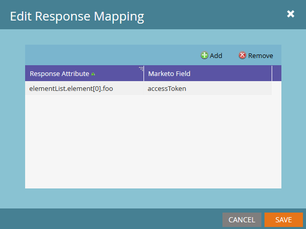
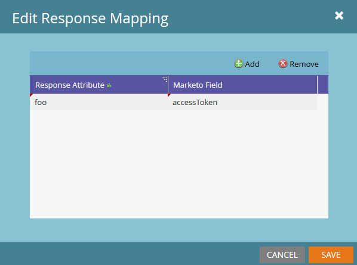

# 응답 매핑

Marketo은 JSON 또는 XML의 웹후크 데이터를 번역하고 해당 값을 리드 필드에 쓸 수 있습니다. Marketo 필드 매개 변수는 항상 필드의 [SOAP API 이름](../rest-api/fields.md)을(를) 사용합니다.

각 웹후크는 응답 매핑을 무제한으로 가질 수 있습니다. 매핑을 추가하거나 편집하려면 웹후크의 응답 매핑 창에서 [!UICONTROL Edit]을(를) 선택하십시오.



응답 매핑은 다음 값을 쌍으로 묶습니다.

- &quot;Response Attribute&quot;: XML 또는 JSON 문서에서 원하는 속성에 대한 경로입니다.
- &quot;Marketo 필드&quot;: Marketo이 응답 속성 값을 작성하는 리드 필드입니다.

Marketo 응답 매핑을 통해 속성에 액세스하려면 해당 키에 영숫자, 대시(-), 밑줄(_), 콜론(:) 및 공백만 포함되어야 합니다.

## JSON 매핑

점 표기법 및 배열 표기법을 사용하여 JSON 속성에 액세스합니다. Marketo 배열 표기법은 문자열이 아닌 정수만 허용합니다.

JSON 문서에서 데이터를 검색하려면 응답 유형을 JSON으로 설정합니다.

```json
{ "foo":"bar"}
```

`foo` 속성은 JSON 개체의 첫 번째 수준에 있습니다. 응답 매핑에서 해당 속성 `name`, `foo`을(를) 사용합니다.



다음 예에는 배열이 포함되어 있습니다.

```json
{
    "profileId" : 1234,
    "firstName" : "Jane",
    "lastName" : "Doe",
    "orders" : [
        {
            "orderId" : 5678,
            "orderDate" : "2015-01-01",
            "orderProductId" : "4982"
        },
        {
            "orderId" : 5678,
            "orderDate" : "2014-05-07",
            "orderProductId" : "4982"
        }
    ]
}
```

orders 배열의 첫 번째 요소에서 orderDate에 액세스하려면 `orders[0].orderDate`을(를) 사용합니다.

## XML 매핑

JSON 매핑과 유사한 점 표기법을 사용하여 개별 XML 요소의 값에 액세스합니다. 다음 예를 생각해 보십시오.

```xml
<?xml version="1.0" encoding="UTF-8"?>
<example>
    <foo>bar</foo>
</example>
```

foo 속성에 액세스하려면 `example.foo`을(를) 사용합니다.

`foo`에 액세스하기 전에 예제 요소를 참조하십시오. 매핑은 속성 계층의 모든 요소를 참조해야 합니다.

배열이 있는 XML 문서의 경우 다음 예를 고려하십시오.

```xml
<?xml version="1.0" encoding="UTF-8"?>
<elementList>
    <element>
        <foo>baz</foo>
    </element>
    <element>
        <foo>bar</foo>
    </element>
    <element>
        <foo>bar</foo>
    </element>
</elementList>
```

부모 배열은 `elementList`입니다. 각 자식 요소에는 `foo` 속성이 있습니다. Marketo 응답 매핑은 배열을 `elementList.element`(으)로 참조하며 `elementList.element[i]`을(를) 통해 해당 하위 항목에 액세스합니다.

elementList의 첫 번째 자식에서 foo 값을 가져오려면 응답 특성 `elementList.element[0].foo`을(를) 사용합니다. 이 매핑은 지정된 필드에 값 &quot;baz&quot;를 반환합니다.

고유한 요소 이름과 고유하지 않은 요소 이름이 모두 포함된 요소 내의 속성에 액세스하면 정의되지 않은 동작이 생성됩니다. 각 요소는 단일 속성 또는 배열이어야 합니다. 유형을 혼합하지 마십시오.

## 유형

속성을 필드에 매핑할 때 Webhook 응답 유형이 대상 필드와 호환되는지 확인합니다. 예를 들어 Marketo은 정수 유형의 필드에 문자열 응답 값을 쓰지 않습니다. 자세한 내용은 [필드 형식](../rest-api/field-types.md)을 참조하세요.
